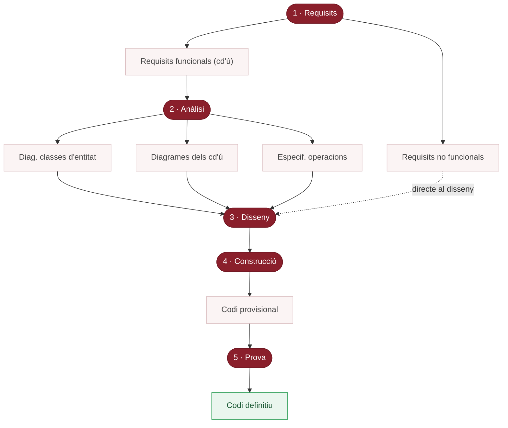

# El mètode de desenvolupament de programari

> **De què va aquest document?** És un esquema (diagrama de flux d'activitats amb *datastores*) que mostra el **mètode de desenvolupament** que se segueix al curs. Representa les fases del procés i, sobretot, **els artefactes (productes) que cada fase genera o consumeix**, indicant l'ordre i les dependències.

## Lectura general de l'esquema

Es llegeix **de dalt a baix**. Els elements arrodonits són les **fases** (Requisits, Anàlisi, Disseny, Construcció, Prova). Els rectangles amb l'estereotip **«datastore»** són els **artefactes/magatzems d'informació** (productes que s'elaboren i alimenten fases posteriors). Les fletxes indiquen el flux.

Flux complet: **Requisits → Anàlisi → Disseny → Construcció → Prova.**

> 🎯 **En un cop d'ull:** 5 fases en cadena; cada fase **consumeix** els artefactes («datastore») de l'anterior i en **produeix** de nous. El **Disseny** és el coll d'ampolla: rep 4 entrades (els 3 de l'Anàlisi + els requisits no funcionals).

## Fase 1 — Requisits

Punt de partida. Genera **dos** artefactes:

- **Requisits no funcionals** — restriccions i qualitats (rendiment, usabilitat, seguretat…); **no** descriuen funcionalitat. → va directament al **Disseny**.
- **Requisits funcionals (cd'ú)** — requisits funcionals expressats com a **casos d'ús**. → va a l'**Anàlisi**.

## Fase 2 — Anàlisi

Entrada: **Requisits funcionals (cd'ú)**. Produeix **tres** artefactes:

- **Diag. classes d'entitat** — model conceptual del domini.
- **Diagrames dels cd'ú** — diagrames associats als casos d'ús.
- **Especif. operacions** — contractes de les operacions del sistema (pre/postcondicions).

→ tots tres alimenten el **Disseny**.

## Fase 3 — Disseny

És la fase amb **més entrades**: els **tres artefactes de l'Anàlisi** + els **Requisits no funcionals** (directament de Requisits). Produeix **cinc** artefactes:

- **Disseny interfícies amb els usuaris** — interacció persona-màquina (pantalles, navegació).
- **Diss. classes entitat** — disseny de les classes del domini per a la implementació.
- **Diss. base dades** — esquema/persistència.
- **Disseny dels cd'ú** — com es realitzen tècnicament (seqüències de disseny, responsabilitats).
- **Interfícies subsistemes** — descomposició en subsistemes i els seus contractes/APIs.

→ tots cinc conflueixen cap a la **Construcció**.

## Fase 4 — Construcció

Entrada: **els cinc artefactes del Disseny**. Produeix:

- **Codi provisional** — codi font implementat, encara no validat.

→ passa a la **Prova**.

## Fase 5 — Prova

Entrada: **Codi provisional**. El valida/verifica. Resultat final:

- **Codi definitiu** — codi ja provat i correcte, producte final.

## Resum del flux d'artefactes

| Fase | Entrades | Artefactes («datastore») produïts |
|------|----------|-----------------------------------|
| **Requisits** | (captura inicial) | Requisits no funcionals · Requisits funcionals (cd'ú) |
| **Anàlisi** | Requisits funcionals (cd'ú) | Diag. classes d'entitat · Diagrames dels cd'ú · Especif. operacions |
| **Disseny** | Els 3 de l'Anàlisi + Requisits no funcionals | Disseny interfícies · Diss. classes entitat · Diss. base dades · Disseny dels cd'ú · Interfícies subsistemes |
| **Construcció** | Els 5 del Disseny | Codi provisional |
| **Prova** | Codi provisional | Codi definitiu |

## Conceptes clau (glossari)

- **Mètode de desenvolupament** — procés estructurat en fases des dels requisits fins al codi definitiu.
- **«datastore»** — estereotip que marca un artefacte/magatzem d'informació generat en una fase i consumit per una altra.
- **Requisit funcional** — descriu **què** ha de fer el sistema; aquí, casos d'ús.
- **Requisit no funcional** — restricció o qualitat; entra directament al Disseny.
- **Cas d'ús (cd'ú)** — interacció entre un actor i el sistema; vehicle dels requisits funcionals.
- **Diagrama de classes d'entitat** — model conceptual del domini (Anàlisi).
- **Especificació d'operacions** — contractes (pre/postcondicions) de l'Anàlisi.
- **Codi provisional** — codi de la Construcció pendent de validació.
- **Codi definitiu** — codi provat i validat; producte final.

## Preguntes de repàs

1. **Fases del mètode i ordre?** Requisits → Anàlisi → Disseny → Construcció → Prova.
2. **Dos artefactes de Requisits i cap a on?** Requisits no funcionals (→ Disseny) i Requisits funcionals/cd'ú (→ Anàlisi).
3. **Tres artefactes de l'Anàlisi?** Diagrama de classes d'entitat, diagrames dels cd'ú i especificació d'operacions.
4. **Per què el Disseny té més entrades?** Rep els tres de l'Anàlisi + els requisits no funcionals (quatre).
5. **Cinc artefactes del Disseny?** Disseny d'interfícies, disseny de classes entitat, disseny de BD, disseny dels cd'ú i interfícies de subsistemes.
6. **Què consumeix i produeix la Construcció?** Consumeix els cinc del Disseny; produeix el codi provisional.
7. **Codi provisional vs. definitiu?** El provisional encara no està validat; el definitiu ha passat la Prova.
8. **Per què els no funcionals no passen per l'Anàlisi?** Perquè no descriuen funcionalitat a modelar, sinó restriccions que es tenen en compte directament al Disseny.
