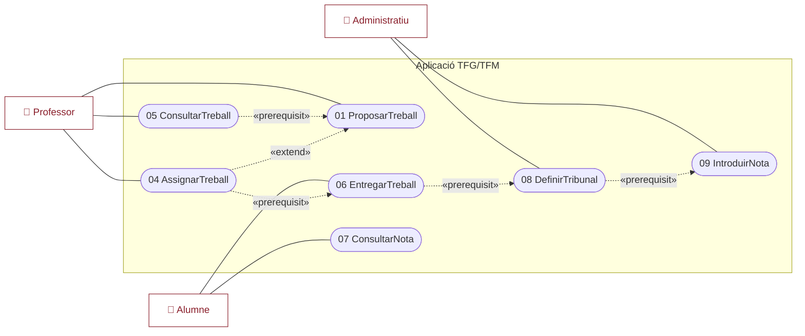
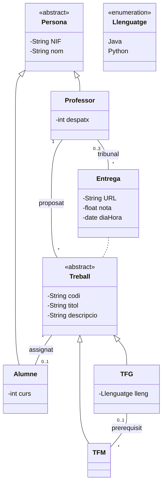
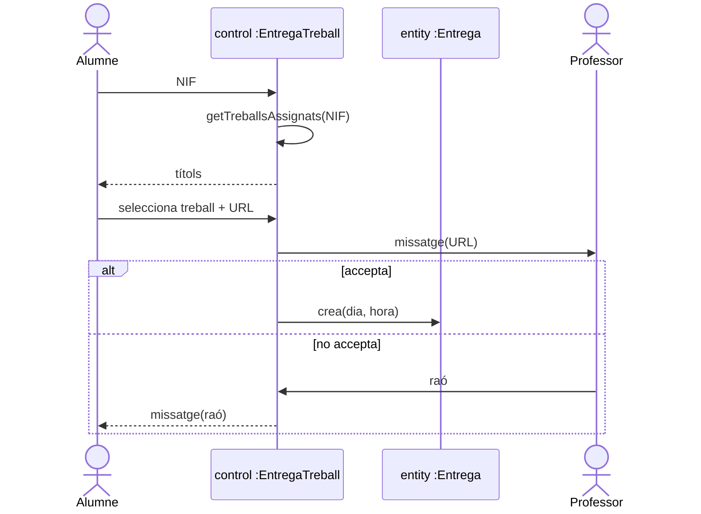

# PAC 2 — Gestió de Treballs Final de Grau i de Màster

> Segona prova d'avaluació continuada (3 hores). Modelat complet d'una aplicació: casos d'ús, especificació textual, classes d'entitat, activitats/seqüències, atributs referencials i pas a taules relacionals.

## Enunciat

### Exercici 1 (20%) — Teoria

- **a)** Què són els requisits no funcionals? Dóna dos exemples.
- **b)** Què és la reenginyeria de codi? Quan és útil?
- **c)** Quines etapes es defineixen a la prova dinàmica?
- **d)** Què és una configuració i de quins tipus n'hi ha?

> 📌 *El PDF de solució oficial només resol l'Exercici 2. Les respostes de l'Exercici 1 (teoria) les trobaràs resoltes a sota, elaborades a partir dels materials del curs (Temes III, VII i VIII).*

### Exercici 2 (80%) — Aplicació de gestió de TFG/TFM

> Cada **professor** (NIF, nom, despatx) pot proposar un nombre indefinit de treballs de grau o de màster. Tots tenen **codi**, **títol** i **descripció**. Els de **grau** indiquen el **llenguatge de programació**. Els de **màster** poden tenir com a requisit haver fet un (i només un) treball de grau previ. El professor assigna un treball a un (i només un) **alumne** (NIF, nom, número de curs); si el treball no està proposat, el pot proposar en aquell moment. Un alumne pot tenir diversos treballs assignats. L'alumne entrega el treball (introdueix el NIF, se li mostren els títols dels seus treballs, en selecciona un i indica la URL); el **professor que l'ha proposat** veu un missatge amb la URL i **accepta** (es guarda l'entrega amb dia i hora) o **no accepta** (indica una raó que es mostra a l'alumne). L'alumne pot consultar la **nota** un cop avaluada per un **tribunal de 3 professors**. L'**administratiu** defineix el tribunal i introdueix la nota (seleccionant d'una llista); els professors també poden fer les tasques de l'administratiu.

**Es demana:** a) casos d'ús (15%); b) especificació textual de l'entrega (10%); c) classes d'entitat (20%); d) activitats o seqüències de l'entrega (10%); e) substituir associacions per atributs referencials (10%); f) taules de la BD relacional (15%).

---

## Solució (explicada)

### Exercici 1 — Respostes teòriques

> 💡 *Respostes elaborades a partir dels materials del curs (el PDF de solució oficial no les incloïa).*

**a) Què són els requisits no funcionals? Dóna dos exemples.**

Són les **característiques de l'aplicació exigides pel client** i les **restriccions imposades per l'entorn i la tecnologia**. A diferència dels funcionals (que diuen *què* ha de fer l'aplicació), els no funcionals diuen **com** ha de ser i **com** s'ha de construir. Es classifiquen en:

- **del producte**: usabilitat, fiabilitat, portabilitat, seguretat, rendiment, eficiència, interoperabilitat, extensibilitat…
- **del procés**: llenguatge de programació, gestor de BD, SO, reutilització de components…

Se solen associar a **mètriques** per avaluar-ne el compliment. *Dos exemples:* (1) *seguretat* — "el programari ha de tenir control d'accés amb identificació de l'usuari"; (2) *procés/producte* — "el llenguatge de programació ha de ser Java" i "ha de funcionar sota Windows 7 i posteriors".

**b) Què és la reenginyeria de codi? Quan és útil?**

És **enginyeria inversa sobre el codi** (obtenir-ne un model), **modificació del model** generat i **regeneració del codi** a partir del model modificat. És **útil per a aplicacions ja existents que no tenen cap model documentat** (codi heretat/*legacy*) que cal entendre, millorar o adaptar. S'aplica sobretot en la fase de **manteniment**.

> ⚠️ No confondre-la amb la **refactorització**, que millora l'estil i l'estructura del codi **sense alterar-ne el funcionament**.

**c) Quines etapes es defineixen a la prova dinàmica?**

En **ordre invers al desenvolupament**:

1. **Unitària** — cada unitat de codi (classe, funció).
2. **Integració** — conjunts d'unitats (*top-down* o *bottom-up*).
3. **Validació** — tota l'aplicació contra els requisits **funcionals**.
4. **Del sistema** — entorn HW/SO/xarxa, contra els requisits **no funcionals**.
5. **D'acceptació (alfa test)** — el client, amb les seves dades.
6. **Beta test** — diversos clients heterogenis (mercat).
7. **De regressió** — després del manteniment.

**d) Què és una configuració i de quins tipus n'hi ha?**

Una **configuració** és el conjunt format pel **programa + documentació d'usuari + documentació de desenvolupament i manteniment**. Tipus:

- **Línia base (*baseline*)**: configuració revisada i acceptada; base del desenvolupament futur (reproduïble, traçable, composició documentada).
- **Versió**: línia base que incorpora canvis a una de prèvia. Casos especials: **variant** (mateixa funcionalitat per a un altre sistema) i **revisió** (substitueix l'anterior).
- **Lliurament (*release*)**: versió que es lliura al client. Cas especial: **delta** (lliurament parcial; *forward* / *reverse*).

---

### Exercici 2 · a) Diagrama de casos d'ús

**Actors:** `Professor`, `Alumne`, `Administratiu`. El Professor pot actuar com a administratiu (connexió `-secundari` cap a la zona administrativa).

**Casos d'ús (9):** `01.ProposarTreball` *(abstracte)*; `02.ProposarTreballGrau` i `03.ProposarTreballMaster` (especialitzacions de 01); `04.AssignarTreball` (extension point `seleccionar treball`); `05.ConsultarTreball`; `06.EntregarTreball`; `07.ConsultarNota`; `08.DefinirTribunal`; `09.IntroduirNota`.

**Associacions:** Professor ↔ 01, 04, 05; Alumne ↔ 06, 07; Administratiu ↔ 08, 09. El Professor és **secundari** de 06 (accepta/refusa dins el mateix procés).

**Relacions entre casos:**

- `05.ConsultarTreball` **`«prerequisit»`** `01.ProposarTreball`.
- `02`/`03` són **especialitzacions** de `01`.
- `04.AssignarTreball` **`«extend»`** `01.ProposarTreball` (punt `seleccionar treball`, "nou treball": si no està proposat, es proposa ara).
- `04` **`«prerequisit»`** `06.EntregarTreball`; `06` **`«prerequisit»`** `08.DefinirTribunal`; `08` **`«prerequisit»`** `09.IntroduirNota`; `09` prerequisit de `07.ConsultarNota`.

**Raonament:** els `«prerequisit»` modelen l'ordre del cicle de vida (proposar → assignar → entregar → tribunal → nota → consultar). L'`«extend»` captura el "si no està proposat, proposa'l ara".

> 📌 `01 ProposarTreball` és **abstracte** i s'especialitza en `02 ProposarTreballGrau` i `03 ProposarTreballMaster`. El Professor és **actor secundari** d'`06 EntregarTreball` (accepta/refusa dins el mateix procés).

### b) Especificació textual — 06. EntregarTreball

- **Resum:** l'alumne entrega un treball assignat i el professor l'accepta o no.
- **Actors:** Alumne i **Professor (secundari)**. **Precondició:** l'alumne té un treball assignat. **Postcondició:** l'entrega queda guardada.
- **Procés normal:**
  1. El sistema demana el NIF a l'**Alumne**.
  2. L'**Alumne** introdueix el NIF.
  3. El sistema consulta els treballs assignats.
  4. El sistema mostra els títols.
  5. L'**Alumne** selecciona un treball.
  6. El sistema demana la URL.
  7. L'**Alumne** introdueix la URL.
  8. El sistema envia un missatge al **Professor** amb la URL.
  9. El **Professor** accepta l'entrega.
  10. El sistema guarda l'entrega amb dia i hora.
- **Alternatives:**
  - 9a. El **Professor** no accepta: 9a1. el sistema demana la raó; 9a2. el Professor la introdueix; 9a3. el sistema envia un missatge a l'Alumne amb la raó.

### c) Diagrama de classes d'entitat

**Herència `Persona`** *(abstracta)* (`-NIF: String{id}`, `-nom: String`), `{complete, disjoint}` (`set2`): `Professor` (`-despatx: int`) i `Alumne` (`-curs: int`).

**Herència `Treball`** *(abstracta, `«Entity»`)* (`-codi: String{id}`, `-titol`, `-descripcio`), `{complete, disjoint}` (`set1`): `TFG` (`-lleng: Llenguatge`) i `TFM`.

**`«enumeration» Llenguatge`**: `Java`, `Python`.

**Classe associativa `Entrega`** `«Entity»` (`-URL: String`, `-nota: float`, `-diaHora: date`) sobre Treball–Alumne.

**Associacions:**

- **Professor — Treball** (`proposat`): `1` — `*`.
- **Treball — Alumne** (`assignat`, amb classe associativa `Entrega`): `0..1` a la banda d'Alumne, `*` a la de Treball.
- **Professor — Entrega** (`-tribunal`): `0..3` professors — `*` entregues.
- **TFG — TFM** (`-prerequisit`): `0..1` — `*`.

**Nota de disseny:** la nota va a `Entrega` i no a una associació amb el tribunal, perquè la nota és **comuna** al tribunal (una sola).

> 💡 Les dues jerarquies són `{complete, disjoint}`. `Entrega` és **classe associativa** sobre Treball–Alumne (hi guarda URL, nota i dia/hora). El **tribunal** = 0..3 professors lligats a l'Entrega.

**Raonament:** es factoritza NIF/nom a `Persona` (`{complete, disjoint}`); `Treball` factoritza codi/títol/descripció; `Entrega` és classe associativa (URL, dia/hora, nota); l'autoassociació TFG↔TFM modela el prerequisit.

### d) Activitats / seqüències de l'entrega

**Diagrama d'activitats** (carrils Professor | Alumne | sistema): inici → `DemanarNif` → `: NIFAlumne` → `IntroduirNIF` → `ConsultarTreballsAssignats` (llegeix `: Alumne {read}`) → `: LlistaTreballs` → `SeleccionarTreball` → `DemanarURL` → `: URLTreball` → `IntroduirURL` → `EnviarMissatge` → `: MissatgeEntrega` → **node de decisió**: `[accepta]` → `GuardarEntrega {create}` → `: Entrega` → fi; `[no accepta]` → `DemanarRao` → `IntroduirRao` → `EnviarMissatge` → `: MissatgeRao` → fi.

**Diagrama de seqüències** (alternativa): ldv `:Alumne`, `:Professor`, `«control» :EntregaTreball` i objectes boundary/entity; fragment **`alt`** amb `[accepta]` (crea `«entity» :Entrega`) i `[no accepta]` (raó → missatge a l'Alumne).

### e) Atributs referencials

Es transformen totes les associacions en atributs `«ref»` amb la multiplicitat de l'associació original:

- **Professor**: `-despatx: int`, `«ref» -ent: Tribunal [*]`, `«ref» -t: Treball [*]`.
- **Treball**: (codi/títol/descripció), `«ref» -p: Professor`, `«ref» -assignat: Alumne [0..1]`.
- **TFG**: `-lleng: Llenguatge`, `«ref» -tfm: TFM [*]`.
- **TFM**: `«ref» -prerequisit: TFG [0..1]`.
- **Entrega**: (URL/nota/diaHora), `«ref» -trib: Tribunal [0..3]`, `«ref» -a: Alumne`, `«ref» -t: Treball`.
- **Alumne**: `-curs: int`, `«ref» -e: Entrega [*]`, `«ref» -t: Treball [*]`.
- **Tribunal**: `«ref» -p: Professor`, `«ref» -ent: Entrega`.

**Comentari de la solució:** com que la multiplicitat d'Entrega cap a Alumne és 1, es podrien incorporar els atributs d'Entrega a Treball i prescindir d'Entrega; es prefereix deixar-los a `Entrega` per no tenir molts atributs a nul.

### f) Pas a taules de la BD relacional

S'apliquen els 10 passos. Estratègia d'herència: **una taula per classe** amb clau forana de la subclasse cap a la superclasse (esborrat en cascada).

- `persona(NIF, nom)` — PK NIF.
- `professor(NIF, despatx)` / `alumne(NIF, curs)` — PK NIF; **CF** cap a `persona(NIF)` (sense nuls ni duplicats, cascada).
- `treball(codi, titol, descripcio, NIF_professor, NIF_alumne)` — PK codi; CF `professor(NIF)` (sense nuls/duplicats), CF `alumne(NIF)` (nuls, duplicats: assignació 0..1).
- `tfg(codi, lleng)` / `tfm(codi, codi_TFG)` — PK codi; CF cap a `treball(codi)` (cascada); `codi_TFG` CF a `tfg(codi)` (nuls, duplicats).
- `entrega(URL, nota, diaHora, NIF_alumne, codi_treball)` — PK (URL, diaHora); CF `alumne(NIF)`, CF `treball(codi)`.
- `tribunal(NIF_professor, URL_entrega, diaHora_entrega)` — PK composta; CF `professor(NIF)`, CF `entrega(URL, diaHora)`.
- **Domini** per a `Llenguatge`.
- **Vistes**: `vprofessor`, `valumne`, `vtfg`, `vtfm` (uneixen subclasse + superclasse).

**Raonament:** l'herència → taula per classe + CF amb cascada (evita NULLs). La classe associativa `Entrega` → taula pròpia. El `Tribunal` (entitat feble) obté la clau de les CF (NIF del professor + identificador de l'entrega).

---

## Errors típics / consells

1. **Relacions entre casos d'ús.** Modela l'ordre del cicle de vida amb `«prerequisit»`; l'`«extend»` (punt `seleccionar treball`) captura el "si no està proposat, proposa'l ara".
2. **Professor com a actor secundari d'EntregarTreball** (accepta/refusa dins el mateix procés); no és un cas separat, sinó el flux alternatiu 9/9a.
3. **Els professors poden fer tasques de l'administratiu** → rol secundari/generalització entre actors, no duplicar casos.
4. **La nota va a `Entrega`, no a una associació amb el tribunal** (la nota és única i comuna; si no, es repetiria 3 cops).
5. **Multiplicitats clau**: Treball→Alumne `0..1`, Alumne→Treball `*`, tribunal `0..3`, prerequisit `0..1`. Confondre-les és l'error més freqüent.
6. **Restriccions `{complete, disjoint}`** a les dues jerarquies (Persona i Treball).
7. **Atributs referencials**: cada `«ref»` porta la multiplicitat de l'associació original (`[*]`, `[0..1]`, `[0..3]` o cap si és 1).
8. **Pas a taules**: CF amb cascada per a l'herència; el `Tribunal` (entitat feble) necessita clau composta a partir de les CF. Indica per a cada CF si admet nuls/duplicats segons la multiplicitat.
