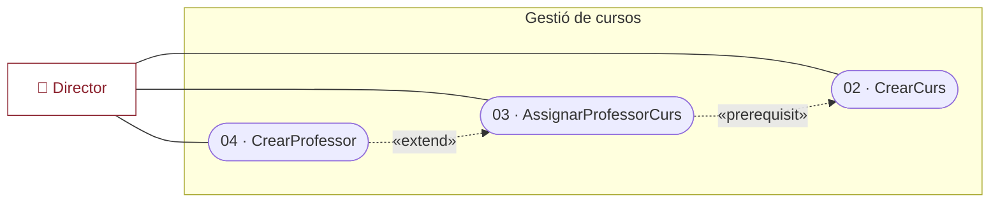
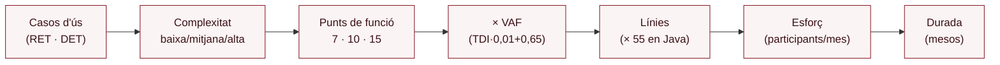

# Tema III — La recollida i documentació dels requisits

> **De què va aquest tema?** Explica què és un requisit (l'acord entre desenvolupadors i client que és base de l'elaboració del producte) i distingeix funcionals i no funcionals. Detalla el procés de recollida i documentació (glossari, regles de negoci, diagrama de casos d'ús i especificació textual) i tanca amb l'estimació de l'esforç (Function Point Analysis) i la priorització (MoSCoW).

## Els requisits d'una aplicació

Els requisits **representen un acord entre desenvolupadors i client** que és la base de partida per a l'elaboració del producte. Tracten de:

- **Què** ha de fer l'aplicació (quines funcions).
- **Com** ho ha de fer.
- **Aspectes del procés de construcció**: mètode de desenvolupament, restriccions tecnològiques, propietats a acomplir.

Han de ser **intel·ligibles per al client** (que els revisarà): més text que notacions formals.

## Classes de requisits

- **Funcionals:** els processos que ha de fer l'aplicació.
- **No funcionals:** característiques exigides pel client i restriccions de l'entorn/tecnologia:
  - **Del producte** (com ho ha de fer): usabilitat, interoperabilitat, fiabilitat, portabilitat, extensibilitat, seguretat, rendiment, eficiència…
  - **Del procés** (com construir-la): llenguatge de programació, gestor de BD, SO, reutilització de components…

## Recollida i documentació (I): informació a recollir

- **Requisits funcionals → Guions:** descriuen seqüències d'operacions que realitzen diferents tipus d'usuaris. S'obtenen d'entrevistes, observacions o documentació existent.
- **Requisits no funcionals:** restriccions en text lliure (entrevistes, documentació, anàlisi del mercat…).

**Cal assegurar:**

- **Traçabilitat**: normes sobre noms dels casos d'ús, numeració de passos, identificadors de regles de negoci… que permeten trobar el requisit al qual correspon qualsevol decisió o artefacte.
- **Completesa, intel·ligibilitat, no-ambigüitat i coherència.**

## Recollida i documentació (II): el procés

1. **Recollida d'informació inicial.**
2. **Redacció dels guions** i agrupació de requisits no funcionals per tipus.
3. **Documentació de requisits funcionals (formal):**
   1. Elaboració del **glossari**: recull ordenat de definicions dels termes propis del projecte.
   2. Fixació de les **regles de negoci**: llistat numerat de restriccions i fórmules (derivació d'atributs, restriccions entre dades, existència, creació i destrucció d'informació…).
   3. Elaboració del **diagrama de casos d'ús**.
   4. **Especificació textual** dels casos d'ús.

## Recollida (III): exemple de glossari i regles de negoci

**Glossari** (sistema de gestió de cursos):

- **Capacitat d'una aula**: nombre d'alumnes que caben en una aula.
- **Línia d'horari**: conjunt format pel dia de la setmana, l'hora d'inici i l'hora de fi d'una sessió setmanal d'un curs.
- **Prerequisit**: curs del qual els alumnes s'han d'haver matriculat abans de matricular-se d'un curs determinat.

**Regles de negoci** (exemples):

1. Un usuari (Director) no es pot esborrar a si mateix.
2. No hi pot haver més d'un usuari amb el mateix nom.
3. No hi pot haver més d'un curs amb el mateix codi.
4. La data de fi d'un curs no pot ser anterior a la d'inici.
5. Un curs no pot ser *prerequisit*, ni directament ni indirectament, de si mateix.
6–7. No hi pot haver més d'un professor amb el mateix NIF / identificador.
8. Tot curs té un professor com a màxim.
9. Un professor no pot estar assignat a dos cursos que se solapin en dates, dia de la setmana i hores.
10. Per crear l'horari d'un curs cal que tingui professor assignat.
11. Les hores d'inici/fi són en punt (17–21 i 18–22).
12–13. Coherència d'hores d'inici i fi per dia de la setmana.
14. No hi pot haver més d'una aula amb el mateix codi.
15. Per assignar aules a un curs cal que tingui horari.

## Diagrama de casos d'ús (I): actors i casos

**Identificació d'actors:**

- **Entitats autònomes amb relació directa amb l'aplicació**: persones, dispositius o sistemes.
- **Primaris**: poden engegar processos (casos d'ús).
- **Secundaris**: participen al procés però no l'engeguen.
- Un actor pot **heretar** els papers d'un altre; hi pot haver **actors abstractes** (només per agrupar).

**Identificació de casos d'ús:**

- Processos autònoms (dels guions) que cal engegar explícitament (no parts d'un procés ni execucions automàtiques).
- Representen funcions ofertes per l'aplicació i descriuen E/S amb els actors.
- Descriuen el **què**, no el **com**.

## Diagrama de casos d'ús (II): relacions

**Entre casos d'ús:**

- **Inclusió:** quan dos o més casos tenen una part comuna que és un cas d'ús per si mateixa.
- **Extensió:** sempre lligada a una **condició**.
- **Especialització:** un cas d'ús és una versió més específica d'un altre.

**Entre actors i casos:**

- Representen una interacció dels actors amb el sistema.
- **Primaris** o **secundaris**. Tot cas d'ús engegable independentment ha de tenir actor primari.
- Multiplicitat per defecte **1-\*** (no se sol indicar).

## Diagrama de casos d'ús (III): precondicions amb «prerequisit»

- Les **precondicions** s'indiquen amb dependències amb l'estereotip **«prerequisit»**.
- Exemple: una fletxa discontínua «prerequisit» de `IdentificarUsuari` cap a `AltaUsuari` significa que, per engegar `IdentificarUsuari`, abans s'ha d'haver executat `AltaUsuari` (no necessàriament de manera consecutiva).

## Diagrama de casos d'ús (IV): exemple (gestió de cursos)

Actor **Director** connectat a casos com **02.CrearCurs** (*extension point*: entrada dades), **03.AssignarProfessorCurs** (*ep*: seleccionar professor), **04.CrearProfessor**, **05.SubstituirProfessor** (*ep*: seleccionar professor 2), **06.EsborrarProfessors**.

Relacions: «prerequisit» de *03* cap a *02*; «extend» de *04* cap a *03* i cap a *05* (condició "professor nou"); «prerequisit» relacionant *05/06* amb els d'assignació/creació.

## Especificació textual dels casos d'ús (I): estructura

Per a cada cd'ú:

- **Capçalera**: número i nom (subratllats), resum, actors involucrats (negreta), paràmetres (in/out), precondició/postcondició.
- **Passos numerats** (procés principal i extensions):
  - **Accions** (atòmiques, una per línia, acabades en `.`, indicant totes les dades): del sistema o d'algun actor (nom en negreta).
  - **Condicions** (acabades en `:`): **només a les extensions**. Condicionen l'execució d'extensions i de seqüències de passos.
  - Es pot referenciar altres casos d'ús (inclosos) o agrupar accions en subprocessos (herència).

## Especificació textual (II): exemple — 00. IdentificarUsuari

- **Resum:** determinar el tipus d'usuari i presentar-li les funcions que li pertoquen.
- **Paràmetres:** cap (entrada/sortida). **Actors:** Usuari.
- **Precondició:** algun usuari donat d'alta. **Postcondició:** usuari identificat, tipus identificat, accés a les funcions del seu tipus.
- **Procés normal:**
  1. El sistema demana nom i contrasenya a l'**Usuari**.
  2. L'**Usuari** introdueix nom i contrasenya.
  3. El sistema presenta les funcions autoritzades segons el tipus.
- **Alternatives/excepcions:**
  - 3a. El nom no existeix o la contrasenya no coincideix:
    - 3a1. El sistema presenta un missatge d'error.
    - 3a2. El sistema torna al pas 1.

## Documentació dels requisits no funcionals

- S'agrupen i es llisten per tipus (tecnologia, seguretat, usabilitat…).
- S'associen a **mètriques** per avaluar-ne el compliment. Exemples: `<rendiment: temps de resposta>`, `<usabilitat: durada d'aprenentatge>`, `<fiabilitat: nombre de fallades>`, `<portabilitat: nombre de plataformes>`.
- Exemples: control d'accés amb identificació (seguretat); Java + Java DB substituïble (disseny/construcció); funcionar sota Windows 7+; manual i ajuda contextual (usabilitat).

## Estimació de l'esforç: Function Point Analysis

- Estima l'esforç calculant les línies de codi de cada cas d'ús; unitat = **punt de funció (FP)**.
- S'avalua el nombre d'FP a partir del **nombre i complexitat de les dades dels casos d'ús**, i d'aquí s'obté el **volum** (línies), l'**esforç** (participants/mes) i la **durada** (mesos).

**Complexitat** (segons nombre de **RET** i **DET** per RET):

| Nombre de RET | 1–19 | 20–50 | >50 |
|---|---|---|---|
| 1 | Baixa | Baixa | Mitjana |
| De 2 a 5 | Baixa | Mitjana | Alta |
| 6 o més | Mitjana | Alta | Alta |

**Complexitat → FP:** Baixa = **7**, Mitjana = **10**, Alta = **15**.

**Fórmules:**

- Factor d'ajustament: **VAF = TDI × 0,01 + 0,65** (TDI de 0 a 70). La suma de FP es multiplica pel VAF.
- **Nombre de línies** = resultat × **55** (cas de Java).
- **Esforç** (pm) = `A × kL^B` (A = 2.4–3.6, B = 1.05–1.2; kL = milers de línies).
- **Durada** (mesos) = `C × esforç^D` (C = 2.5, D = 0.32–0.38).
- **Participants mitjans** = esforç / durada.

## Planificació de requisits: mètode MoSCoW

- **Must have**: compliment obligatori.
- **Should have**: no obligatori, alta prioritat.
- **Could have**: no obligatori, baixa prioritat.
- **Won't have this time**: no en aquesta entrega, però es deixa pel futur.
- Aproximadament **60% Must Have i 40% la resta**. Es defineix quins casos d'ús es consideren a cada **increment**.

## Conceptes clau (glossari)

- **Requisit** — acord entre desenvolupadors i client, base de l'elaboració del producte.
- **Requisit funcional** — procés que ha de fer l'aplicació.
- **Requisit no funcional** — característica o restricció (del producte o del procés).
- **Guió** — descripció d'una seqüència d'operacions que realitzen diferents tipus d'usuaris.
- **Traçabilitat** — normes (noms, numeració, identificadors) que lliguen cada artefacte al seu requisit.
- **Glossari** — recull ordenat de definicions dels termes propis del projecte.
- **Regla de negoci** — restricció o fórmula numerada relativa als processos.
- **Actor** — entitat autònoma (persona, dispositiu o sistema) amb relació directa amb l'aplicació.
- **Actor primari / secundari** — el primari engega casos d'ús; el secundari hi participa però no els engega.
- **Cas d'ús** — procés autònom que cal engegar explícitament; descriu el què, no el com.
- **Inclusió / Extensió / Especialització** — relacions entre casos d'ús.
- **«prerequisit»** — estereotip que indica una precondició (un cas d'ús s'ha d'haver executat abans).
- **Punt de funció (FP)** — unitat de feina per estimar l'esforç.
- **RET / DET** — classe/registre que tracta un cas d'ús (RET) / dada continguda en un RET (DET).
- **VAF** — factor d'ajustament = TDI × 0,01 + 0,65.
- **MoSCoW** — mètode de priorització (Must / Should / Could / Won't have).

## Preguntes de repàs

1. **Què representa un requisit?** Un acord entre desenvolupadors i client, base de partida per a l'elaboració del producte.
2. **Funcionals vs. no funcionals?** Funcionals = processos que ha de fer; no funcionals = característiques/restriccions (del producte o del procés).
3. **Ordena els 4 passos de la documentació formal de requisits funcionals.** Glossari → regles de negoci → diagrama de casos d'ús → especificació textual.
4. **Actor primari vs. secundari?** El primari pot engegar casos d'ús; el secundari participa però no l'engega.
5. **Tres relacions entre casos d'ús; en què consisteix l'extensió?** Inclusió, extensió, especialització. L'extensió sempre va lligada a una condició.
6. **Què indica «prerequisit»?** Una precondició: un altre cas d'ús s'ha d'haver executat abans (no necessàriament consecutiu).
7. **On poden aparèixer les condicions a l'especificació textual?** Només a les extensions.
8. **Què determina la complexitat d'un cas d'ús al FPA?** El nombre de RETs i el nombre de DETs per RET.
9. **FP de complexitat baixa/mitjana/alta?** 7 / 10 / 15.
10. **Fórmula del VAF i com s'aplica?** VAF = TDI × 0,01 + 0,65; la suma de FP es multiplica pel VAF, i en Java les línies = resultat × 55.
11. **Què significa MoSCoW i quina proporció es recomana?** Must/Should/Could/Won't have; ≈ 60% Must i 40% la resta.
