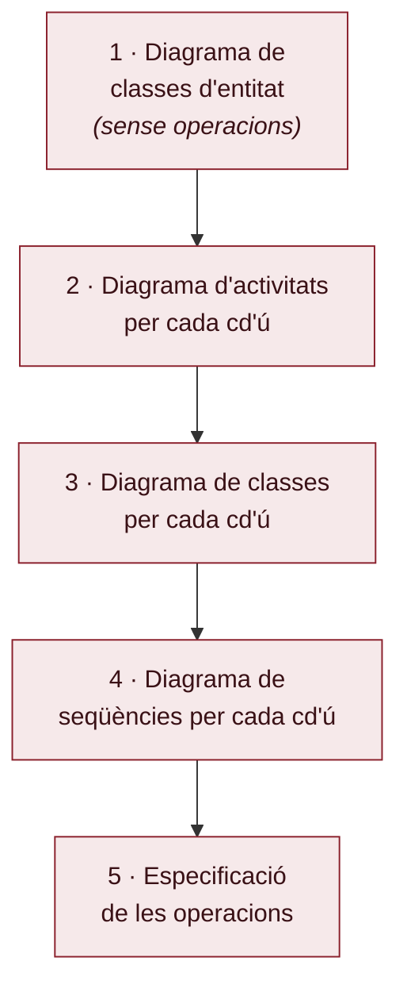

# Tema IV — L'anàlisi dels requisits

> **De què va aquest tema?** Explica com transformar l'especificació textual dels casos d'ús en un model orientat a objectes que serveixi de base per al disseny. Es defineixen els tres tipus de classes de l'anàlisi (entitat, frontera i control) i els cinc passos de l'anàlisi amb els diagrames UML associats.

## Objectiu de l'anàlisi dels requisits

- **Transformar l'especificació textual dels casos d'ús a forma d'objectes** per obtenir una base més adequada per al disseny.
- Es fa **independentment de les eines concretes** de programació (llenguatge, BD); això es decideix al disseny.
- **Només es consideren els requisits funcionals.**

## Les classes de l'anàlisi de requisits

S'utilitzen **classes de 3 tipus**:

- **Classes d'entitat**: contenen les dades que s'han d'emmagatzemar i tractar.
  - Generalment **persistents** (BD, fitxers).
  - S'identifiquen els *atributs* que emmagatzemen.
  - Són **independents dels casos d'ús** que les fan servir.
- **Classes de frontera**: representen les E/S amb els actors del cd'ú (finestres, impressora, correu…).
  - S'identifiquen els *atributs* que s'hi mostren (sovint part dels atributs d'algunes classes d'entitat).
  - Hi haurà **almenys una per cada cas d'ús interactiu i actor**.
- **Classes de control**: implementen el procés general dels cd'ú.
  - Normalment **una per cada cas d'ús**.
  - **Es creen quan s'engega el cd'ú i es destrueixen quan acaba.**
  - Els seus *atributs* són els paràmetres d'execució del cas i els paràmetres/valors de retorn d'operacions demanades a classes d'entitat o frontera.

**Notació (estereotips UML):** entitat = cercle amb línia base inferior; frontera = cercle amb una barreta vertical a l'esquerra; control = cercle amb fletxa circular.

## La identificació de les classes de l'anàlisi

- Les **classes d'entitat** es construeixen **agrupant dades que surten als passos dels cd'ú**.
- Les **classes de control i de frontera** s'identifiquen **a partir del seu cd'ú**:
  - Una **classe de control** per cada cd'ú.
  - Una **classe de frontera diferent per cada interacció diferent** (entrada de dades, presentació de dades, selecció d'opcions…) entre el sistema i un actor.

## Els cinc passos de l'anàlisi

1. **Diagrama de classes d'entitat** amb atributs, associacions i herència però **sense operacions**.
2. **Diagrama d'activitats per cada cd'ú**, identificant les classes de frontera.
3. **Diagrama de classes per cada cd'ú** amb les classes d'entitat, frontera i control que hi intervenen i els seus atributs.
4. **Diagrama de seqüències per cada cd'ú** que representa les interaccions entre classes de control, frontera i entitat i actors.
5. (Opcional) **Especificació de les operacions** de les classes.

> 🧠 **Els 3 tipus de classe (recorda'ls!):** **Entitat** = les dades persistents (independents del cd'ú) · **Frontera** = les E/S amb l'actor (finestres) · **Control** = el procés del cd'ú (es crea a l'inici i es destrueix al final).

## 1. El diagrama de les classes d'entitat

- Identificar **atributs**, **tipus de dades** (independents del llenguatge), **propietats** i **derivació d'atributs** a partir dels passos dels cd'ú i les **regles de negoci**.
- **Classes**: agrupacions d'atributs relacionats.
- **Herència** (complete? overlap? abstract? múltiple?): atributs compartits.
- **Associacions** (multiplicitat, tipus, papers, navegabilitat…): del glossari + regles de negoci.
- De vegades convé fer el **diagrama d'estats** d'alguna classe d'entitat.

**Exemple (CrearCurs / CrearProfessor):** classe `Curs` (`-codi: String{id}`, `-denominacio`, `-nPlaces`, `-dataInici`, `-dataFi`, `-preu`) amb autoassociació `-prerequisit` (`*`…`*`); classe `Professor` (`-NIF: String{id}`, `-nom`, `-identificador: String{id}`) associada a `Curs` (`0..1`…`*`).

## 2. El diagrama d'activitats d'un cd'ú

**Partint dels passos del cd'ú** es fa un diagrama d'activitats amb:

- Una **partició** per a cada actor i una per al sistema.
- Una **acció** per a cada pas d'un actor o del sistema (activitat estructurada amb nom de cd'ú quan s'executa un altre cd'ú o subprocés).
- **Nodes de control** per a les *alternatives de procés i excepcions*.
- **Nodes d'objecte**:
  - *Objectes/Datastores de les classes d'entitat* segons les dades llegides o gravades, indicant l'operació (**read, update, create**).
  - *Objectes de les classes de frontera* per a les dades mostrades/introduïdes a les interaccions.
  - *Arcs d'objectes amb pins* per a la resta de dades entre accions.

**Exemple (04. CrearProfessor):** dues particions (Director | Sistema): inici → `DemanarDadesProfessor` → frontera `: DadesProfessor` → `DonarDadesProfessor` → `CrearProfessor {create}` → entitat `nou: Professor` → fi.

## 3. El diagrama de les classes d'un cd'ú

**Partint del diagrama d'activitats** es fa un diagrama de classes amb:

- Les **classes d'entitat** que surten.
- Les **classes de frontera**, afegint els atributs de les dades que es mostren/introdueixen.
  - **No s'indiquen els tipus** dels atributs (depenen de la tecnologia de la GUI).
- La **classe de control**, amb atributs/tipus dels paràmetres del cd'ú o d'operacions demanades/rebudes.
- **No es representen les associacions.**

**Exemple (04. CrearProfessor):** frontera `DadesProfessor` (NIF, nom, identificador, sense tipus); control `CrearProfessor` (`nou: Professor`, `NIF: String`, `nom: String`, `identificador: String`); entitat `Professor`.

## 4. El diagrama de seqüències d'un cd'ú

**Partint del diagrama d'activitats** es fa un diagrama de seqüències amb:

- **Línies de vida (ldv)**, d'esquerra a dreta:
  - Una de cada **actor** (existeix des de l'inici).
  - Almenys una de cada **classe de frontera** (les crea el control, es destrueixen al final o sota demanda).
  - Una de la **classe de control** (es crea a l'inici a petició de l'actor, es destrueix al final).
  - Almenys una de cada **classe d'entitat** (existeixen des de l'inici si es consulten/modifiquen, o es creen).
- **Missatges**: esdeveniments de l'actor sobre fronteres; creació de ldv; lectures/gravacions de les entitats (amb paràmetres) pel control; retorns de lectures síncrones; altres transferències.
- **Fragments d'interacció**: `alt`/`opt` (alternatives), `loop` (bucles), `ref` (usos d'interacció dels cd'ú cridats).

**Exemple (04. CrearProfessor):** ldv de `: Director`, `: DadesProfessor` (frontera), `: CrearProfessor` (control) i `nou: Professor` (entitat). El Director envia "dades professor"; la frontera passa `(NIF, nom, identificador)` al control, que crea `nou: Professor` i en rep `(nou)`.

## 5. L'especificació de les operacions de les classes

Les **operacions** associades a les ldv:

- **S'afegeixen a la classe** respectiva i s'actualitza el diagrama de classes.
- S'especifiquen **paràmetres i tipus** (signatura).
- Per a operacions no trivials, se n'especifica el **procés textualment**.

**Exemple (classe Curs):** `llegirTotsExcepte(Curs c): Curs[*] {isQuery}`, `llegirSenseProfessor(): Curs[*] {isQuery}`, `llegirSenseHorari(): Curs[*] {isQuery}`, `llegirSenseAules(): Curs[*] {isQuery}`, `setPrerequisits(pr: Curs[*])`, `setProfessor(p: Professor)`, `setLiniesHorari(lH: LiniaHorari[1..5])`.

## Conceptes clau (glossari)

- **Classe d'entitat** — conté les dades a emmagatzemar i tractar; persistent i independent dels cd'ú.
- **Classe de frontera** — representa les E/S amb els actors; almenys una per cada cd'ú interactiu i actor.
- **Classe de control** — implementa el procés general d'un cd'ú; es crea a l'inici i es destrueix al final.
- **cd'ú** — cas d'ús.
- **Regles de negoci** — restriccions del domini que han de complir dades i operacions.
- **Diagrama de classes d'entitat** — atributs, associacions i herència, sense operacions.
- **Diagrama d'activitats** — passos del cd'ú amb particions (actors/sistema), accions, nodes de control i d'objecte (read/update/create).
- **Datastore** — node d'objecte persistent que representa dades llegides/gravades a BD.
- **Diagrama de seqüències** — interaccions entre ldv mitjançant missatges, amb fragments alt/opt/loop/ref.
- **Línia de vida (ldv)** — representació d'un objecte/actor al diagrama de seqüències al llarg del temps.
- **isQuery** — propietat d'una operació que indica que només consulta (no modifica l'estat).

## Preguntes de repàs

1. **Objectiu de l'anàlisi dels requisits?** Transformar l'especificació textual dels casos d'ús a objectes per obtenir una base millor per al disseny, considerant només els requisits funcionals i independentment de les eines.
2. **Quins tres tipus de classes s'utilitzen?** Entitat, frontera i control.
3. **Quina classe es crea en engegar el cd'ú i es destrueix en acabar?** La de control (una per cd'ú).
4. **D'on s'obtenen les classes d'entitat i les de control/frontera?** Les d'entitat, agrupant dades dels passos dels cd'ú; les de control/frontera, a partir del cd'ú (una de control per cd'ú; una de frontera per interacció diferent).
5. **Els cinc passos en ordre?** Classes d'entitat → activitats → classes del cd'ú → seqüències → (opcional) operacions.
6. **Per què no s'indiquen els tipus dels atributs de la classe de frontera?** Perquè depenen de la tecnologia de la interfície gràfica.
7. **Quines operacions read/update/create apareixen i sobre quins nodes?** Sobre els nodes d'objecte/Datastore de les classes d'entitat.
8. **Què representen alt, opt, loop i ref?** alt/opt = alternatives, loop = bucles, ref = usos d'interacció de cd'ú cridats.
9. **Per què el diagrama de classes d'entitat es fa "sense operacions"?** Perquè en aquest pas només es modelen atributs, associacions i herència; les operacions s'afegeixen al pas 5.
10. **Què conté la signatura d'una operació?** Nom, paràmetres amb tipus i, si cal, propietats (`{isQuery}`); per a operacions no trivials, també el procés textual.
