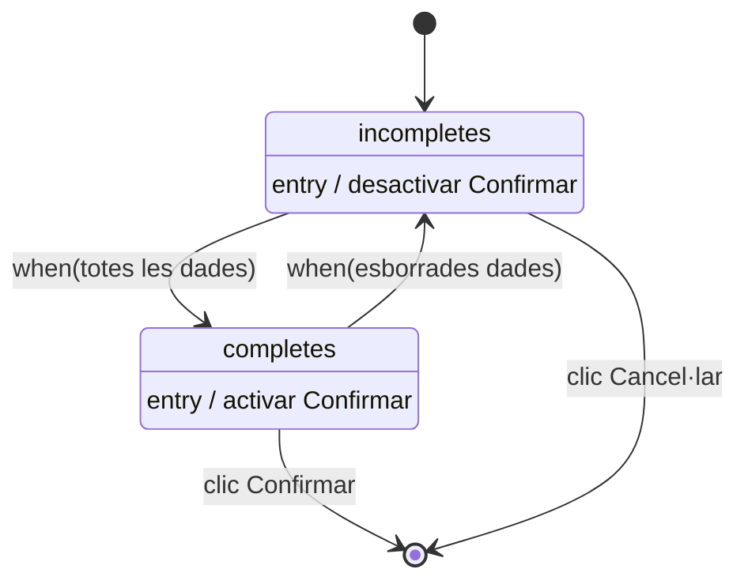

# Tema V — El disseny de la interfície amb els usuaris

> **De què va aquest tema?** Tracta la fase de disseny centrant-se en el disseny de la interfície amb els usuaris a partir de les classes de frontera de l'anàlisi. Explica els principis del disseny d'interfícies (inclosos els principis Gestalt), les guies d'estil i les finestres mare, i les quatre activitats del procés: metàfora, selecció dels cd'ú, disseny dels diàlegs (diagrames d'estats) i disseny de les classes de frontera.

## Etapes del disseny

El disseny té dues etapes:

- **Disseny de la interfície amb els usuaris** (objecte d'aquest tema).
- Disseny de les classes d'entitat i de la persistència (BD) → Tema VI.

## Objectiu del disseny

**Obtenir una especificació de l'aplicació a construir que satisfaci els requisits quant a:**

- **el què** (solució per als requisits funcionals),
- **el com** (requisits no funcionals del producte),
- **la tecnologia a aplicar** (requisits no funcionals del procés).

El disseny consisteix encara en **diagrames UML**, principalment, tot i que alguns aspectes dependran de la tecnologia.

## Principis (I): equilibri entre automatització i control

- Fer servir **poques finestres modals** (interrompen la tasca).
- Fer servir **assistents** que guiïn sense forçar.
- **Permetre interrupcions**, guardant entrades parcials.
- Les accions s'han d'executar **immediatament** i ser **reversibles**.
- Donar **retroacció** de les accions i mostrar **progrés** en accions llargues.
- Suportar **personalització** (colors, botons, col·locació…).

## Principis (II): minimització de la càrrega de memòria i consistència

**Minimització de la càrrega de memòria de l'usuari:**

- No fer recordar/introduir allò que l'ordinador ja sap.
- Recordar el punt i la informació introduïda abans d'una interrupció.
- Fer servir **valors per omissió i camps autocompletats**.
- Recordatoris de les opcions seleccionades i **ajuda contextual**.
- Fer servir **icones més que menús de text**.
- Fer servir **mnemotècnics estàndard** (Ctrl+C).

**Consistència: presentar igual allò que és el mateix.** Aprofita els **hàbits adquirits** i manté **homogeneïtat** (finestres, títols, botons, colors, lletra, icones, mnemotècnics) entre versions i productes.

## Principis (II): Gestalt

**Gestalt** és un conjunt de principis (psicològics) que aporten **forma, estructura i organització** a la interfície:

- **Proximitat**: elements semblants s'han de representar a prop els uns dels altres.
- **Regió comuna**: elements a la mateixa regió es perceben com a grup.
- **Semblança**: elements amb característiques visuals similars es perceben com relacionats.
- **Continuïtat**: elements organitzats en línia es perceben com a relacionats.

## Principis (III): guies d'estil

S'usen **estàndards a nivell de projecte: guies d'estil** (del projecte o de l'empresa client):

- Donen **uniformitat d'estil**.
- Afecten les **parts fixes de les finestres** (capçalera, logotip, col·locació de botons estàndard).
- Defineixen tipus/mida de lletra i colors.
- **Fixen la representació de cada dada**, que s'ha de mantenir sempre.
- Les finestres **no es dissenyen des de zero**, sinó com a còpies (**refactorització**) de **finestres mare**.

## Principis (IV): finestres mare

- **Finestra primària**: títol + àrea de treball, amb botons estàndard **Ajuda**, **Cancel·lar** i **Confirmar**.
- **Finestra secundària**: tipus missatge (títol "Missatge", àrea de text) amb botó **Vist**.

## Esquema del procés de disseny de la interfície

**Definir l'aparença i el comportament de les classes de frontera de l'anàlisi.** Activitats:

1. **Disseny de la representació gràfica (*metàfora*) de les dades.**
2. **Disseny de la selecció del cd'ú a executar** (menús/barres d'eines).
3. **Disseny dels diàlegs dels cd'ú** (diagrames d'estats compostos/submàquina).
4. **Disseny de les classes de frontera** (aspecte gràfic de les finestres).

## 1. La metàfora

- Cada dada del programa (atribut de les classes d'entitat) **es visualitza igual arreu**.
- Escollir el **control gràfic**, aspecte i etiqueta:
  - **Valor lliure** → *camp de text*.
  - **Conjunt de valors** → *llista* (selecció múltiple?).
  - **Enumerats curts** → *radio buttons*.
  - **Enumerats llargs** → *llista / combo box*.
  - **Selecció booleana** → *check box*.
  - **Altres**: contrasenya (*pwd field*), valors ordinals (*slide*)…

**Exemple (curs i element d'horari):** `Curs` → Codi (`XX99`), Denominació (camp llarg), Data inici/fi (`99 99 9999`), Preu (`999.99`), Places (`99`). `LiniaHorari` (`-diaSetmana: DiaSetmana{id}`, `-horaInici`, `-horaFi`) → combo boxes.

## 2. Disseny de la selecció de casos d'ús

- Típicament **menús** (+ tecles) i/o **barres d'eines**.
- **Jerarquia de menús** agrupats per **acció** (orientats al procés) o per **classe d'entitat** (orientats al producte). A cada cas d'ús li correspon una entrada del nivell més baix.
- **Dreceres** (`Ctrl+X`) per als cd'ú habituals; **acceleradors** (`Alt`+lletra inicial) per navegar pel menú.
- **Barres d'eines**: botons amb icones (casos més freqüents), personalitzables.
- El menú/barra pot ser **diferent per cada actor** o tenir opcions desactivades segons els prerequisits.

**Exemple (menú del director):** Usuaris (→ Crear, Esborrar), Cursos (→ Crear), Professors (→ Crear, Assignar, Substituir, Esborrar) i Sortir.

## 3. Disseny dels diàlegs dels casos d'ús

- Especifica el **comportament de les finestres** de cada cd'ú.
- Parteix dels **diagrames d'activitats i de seqüències**.
- Es representa amb **diagrames d'estats**:
  - **Per cada cas d'ús** → **una màquina d'estats**.
  - **Per cada finestra/classe frontera**:
    - **Primària** → *estat compost o de submàquina* (estats simples per al comportament intern, p. ex. activar/desactivar botons). Es poden **reutilitzar màquines d'estats**.
    - **Secundària** (missatges, confirmacions) → *estat simple*.
  - **Transicions** provocades per **esdeveniments** de l'usuari (senyals); s'indiquen les **accions** del sistema (classe + mètode).
  - S'afegeix el **control d'errors d'E/S** (camps buits, format incorrecte…).

**Exemple (diàleg CrearProfessor):** estat `DadesProfessor: IntroduccioDades`; en confirmar → `/comprovar NIF repetit`; `[NIF repetit]` → `M1: Missatge`; `[else] / comprovar identificador repetit`; `[identificador repetit]` → `M2: Missatge`; `[else] / gravar professor` → fi.

**Màquina reutilitzable `IntroduccioDades`:** estats `incompletes` (entry / desactivar "Confirmar") i `completes` (entry / activar "Confirmar"); transició `when(posades totes les dades obligatòries)` i de tornada `when(esborrades dades obligatòries)`; `clic "Cancel·lar"` surt, `clic "Confirmar"` acaba.

> 🎯 **Idea del tema:** cada **cd'ú** té UNA màquina d'estats. Finestres **primàries** → estat compost/de submàquina; **secundàries** (missatges) → estat simple. Les transicions les disparen els **esdeveniments de l'usuari** i porten les **accions** (classe + mètode).

## 4. Disseny de les classes de frontera

- Especifica l'**aspecte gràfic** de les finestres.
- Es fa a partir de les **finestres mare** (guia d'estil) mitjançant **refactorització**.
- S'incorporen els **controls gràfics de la metàfora** per a cada atribut i s'apliquen els **principis del disseny**.
- Per **traçabilitat**, el nom de la finestra = nom de l'estat i de la classe de frontera.

**Exemple (CrearProfessor — finestra DadesProfessor):** combina el diagrama de classes del cd'ú (frontera `DadesProfessor`), la metàfora del Professor (NIF `99999999X`, Nom, Identificador) i la finestra mare primària → finestra "Dades del professor" amb camps NIF, Nom, Identificador i botons Ajuda/Cancel·lar/Confirmar.

## Conceptes clau (glossari)

- **Metàfora** — representació gràfica fixa de cada dada, visualitzada igual arreu.
- **Guia d'estil** — estàndard de projecte/empresa que dóna uniformitat (capçalera, botons, lletres, colors, representació de dades).
- **Finestra mare** — finestra plantilla (primària o secundària) per dissenyar la resta per refactorització.
- **Finestra primària** — principal amb àrea de treball i botons Ajuda/Cancel·lar/Confirmar; al diagrama d'estats és estat compost o de submàquina.
- **Finestra secundària** — de missatge/confirmació amb botó Vist; estat simple.
- **Finestra modal** — interromp la tasca; convé fer-ne servir poques.
- **Principis Gestalt** — proximitat, regió comuna, semblança, continuïtat.
- **Consistència** — presentar igual allò que és el mateix.
- **Drecera (shortcut)** — combinació de tecles (Ctrl+X) per a un cd'ú habitual.
- **Accelerador** — Alt+lletra inicial per navegar pel menú.
- **Jerarquia de menús** — organització orientada al procés (acció) o al producte (classe d'entitat).
- **Diagrama d'estats (màquina d'estats)** — especifica el comportament dels diàlegs (una per cd'ú).
- **Control d'errors d'E/S** — validació de camps buits, formats incorrectes…
- **Traçabilitat** — correspondència de noms entre estat, classe de frontera i finestra.
- **Refactorització** — dissenyar una finestra com a còpia/adaptació d'una finestra mare.

## Preguntes de repàs

1. **Les dues etapes del disseny?** Disseny de la interfície amb els usuaris, i disseny de les classes d'entitat i de la persistència (BD).
2. **Què vol dir "el què", "el com" i "la tecnologia"?** El què = requisits funcionals; el com = requisits no funcionals del producte; la tecnologia = requisits no funcionals del procés.
3. **Anomena els quatre principis Gestalt.** Proximitat, regió comuna, semblança i continuïtat.
4. **Les quatre activitats del procés, en ordre?** Metàfora → selecció del cd'ú (menús/barres) → diàlegs (diagrames d'estats) → classes de frontera (aspecte gràfic).
5. **Control per a una selecció booleana? I per a enumerats curts?** Check box; radio buttons.
6. **Drecera vs. accelerador?** Drecera = tecles (Ctrl+X) per executar directament; accelerador = Alt+lletra per navegar pel menú.
7. **Com es modelen finestres primàries i secundàries al diagrama d'estats?** Una màquina per cd'ú; primàries = estats compostos/de submàquina; secundàries = estats simples.
8. **Què provoca les transicions i què s'hi indica?** Els esdeveniments de l'usuari (senyals); s'hi indiquen les accions del sistema (classe + mètode).
9. **Com s'aconsegueix la traçabilitat a les classes de frontera?** El nom de la finestra coincideix amb el de l'estat i el de la classe de frontera.
10. **De quins tres elements parteix el disseny d'una finestra?** Del diagrama de classes del cd'ú, de la metàfora de la dada i de la finestra mare primària de la guia d'estil.
