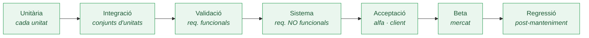

# Tema VIII — La prova

> **De què va aquest tema?** Tracta la prova del programari: comprovar que l'aplicació té totes les funcions (validació) i les fa correctament (verificació). Distingeix prova estàtica i dinàmica, descriu les etapes i tècniques de prova, les eines de suport i el procés d'engegada del sistema amb els usuaris.

## Concepte i classes de prova

La prova comprova que el programari elaborat:

- té totes les funcions que ha de tenir → **validació**,
- i les fa correctament → **verificació**.

**Classes:**

- **Prova estàtica**: el codi es revisa **sense executar-lo**.
- **Prova dinàmica**: el codi s'**executa** i es comparen els resultats obtinguts amb els esperats. Les discrepàncies són les **fallades**.

En cas de fallades es fa la **depuració (debugging)**.

## Errors i fallades

**Tipus d'errors:** funcionals (omissions de requisits funcionals), del sistema (altres programes, SO, llibreries), de comunicacions, de lògica (codi no ajustat als requisits), d'interfície d'usuari, de dades (accés a BD), de codificació, i de proves (correccions equivocades o incompletes).

## La prova estàtica

Consisteix en **revisions** que analitzen:

- *Flux de control*: parts no executades mai, bucles que poden no acabar.
- *Ús de variables*: usades abans d'inicialitzar, no usades, inicialitzades més d'un cop, límit de matrius.
- *Paràmetres de les crides*: discrepàncies de tipus, ús de valors de retorn, in/out.
- *Camins d'execució*: quines instruccions s'executen en cadascun.

Els entorns de desenvolupament inclouen eines d'ajuda.

## La prova dinàmica

**Execució sencera o per parts i comprovació de resultats.**

**Etapes (ordre invers al desenvolupament):**

- **Prova unitària**: per cada unitat de codi (classe, funció…). Automatitzable i *completa*.
- **Prova d'integració**: per conjunts d'unitats cada vegada més complexos. *Top-down* o *bottom-up*.
- **Prova de validació**: tota l'aplicació funciona d'acord amb els *requisits funcionals*.
- **Prova del sistema**: sobre l'entorn hardware/SO/xarxa previstos, contra els *requisits no funcionals* (configuracions, recuperació, seguretat, estrès, càrrega, control d'accés…).
- **Prova d'acceptació (alfa test)**: pel client i amb les seves dades.
- **Beta test**: amb diversos clients heterogenis (programari per al mercat).
- **Prova de regressió**: després del manteniment, per comprovar que el codi no modificat continua funcionant.

> 📌 **Clau:** validació = "té totes les funcions?" · verificació = "les fa bé?" · **caixa blanca** mira l'estructura interna, **caixa negra** només la funcionalitat (classes d'equivalència, valors fronterers, causa-efecte).

**Activitats de cada etapa:** planificació; elaboració dels **casos de prova**; preparació de la infraestructura; realització; revisió de resultats (comparant amb els esperats); depuració.

Un **cas de prova** és l'especificació d'una prova concreta: **identificador, valors d'entrada i resultat correcte esperat**.

**Tècniques (dues menes):**

- **Caixa blanca**: tenen en compte l'estructura interna (prova més exhaustiva): instruccions, punts de decisió, camins, bucles…
- **Caixa negra**: només consideren la funcionalitat:
  - *Classes d'equivalència*: rangs de valors d'entrada amb el mateix comportament esperat; provar un exemple de cadascun.
  - *Valors fronterers*: valors que delimiten els rangs (`<` vs. `<=`).
  - *Causa–efecte*: diagrames de causa-efecte → taula/arbre de decisió → cada regla esdevé un cas de prova.

**Taules i arbres de decisió:** determinen com un conjunt de condicions engega diferents processos (*tractaments*). La taula té files de Condicions (S/N/—) i de Tractaments (X); cada columna és una regla. L'arbre ramifica per cada condició (Sí/No) fins als tractaments fulla.

## Eines

**Per a la prova estàtica:** editors i compiladors (variables no declarades/usades/inicialitzades, discrepàncies de paràmetres).

**Per a la prova dinàmica:**

- *Generadors de dades de prova* (a partir de l'estructura d'una BD, codi, interfície…).
- *Drivers*: permeten provar unitàriament objectes individuals (inicialitzacions i crides).
- *Stubs*: simulen les funcions d'un mòdul cridat pel que es vol provar.
- *Debuggers*: control de l'execució (pas a pas, breakpoints, modificar valors o codi).
- *Captura*: recullen accions de l'usuari i respostes del sistema.

## L'engegada

**Activitats que calen perquè els usuaris comencin a utilitzar l'aplicació** (un cop construïda, provada i acceptada).

- (Abans) Prova d'acceptació (a mida) o beta test (mercat).
- Lliurament de l'aplicació (executable + font (a mida)) amb documentació (manual, tutorial, exemples).
- Organització de l'ús (workflow de l'empresa, tipus d'usuaris).
- Formació dels usuaris.
- Represa de la informació existent a la BD.
- Canvi de sistema (substitució de l'antic programari).

**Estratègies de canvi de sistema:**

- **En paral·lel**: usuaris treballen un temps amb els 2 sistemes. *Segura però costosa; es pot eternitzar.*
- **De cop**: durant la nit o cap de setmana. *Econòmic i directe, però si hi ha problemes s'atura l'activitat.*
- **Amb un grup pilot**: petit grup per "rodar-lo". *Econòmic i segur, però difícil trobar un grup aïllat.*
- **Per etapes**: per parts del producte o grups d'usuaris. *Quan hi ha limitacions de recursos.*

## Conceptes clau (glossari)

- **Prova** — comprovar que el programari té totes les funcions (validació) i les fa correctament (verificació).
- **Validació** — comprovar que té totes les funcions que ha de tenir.
- **Verificació** — comprovar que les fa correctament.
- **Fallada** — discrepància entre el resultat obtingut i l'esperat en la prova dinàmica.
- **Prova estàtica** — revisió del codi sense executar-lo.
- **Prova dinàmica** — execució del codi i comparació de resultats.
- **Cas de prova** — identificador, valors d'entrada i resultat correcte esperat.
- **Caixa blanca** — té en compte l'estructura interna del codi.
- **Caixa negra** — només considera la funcionalitat (classes d'equivalència, valors fronterers, causa-efecte).
- **Classes d'equivalència** — rangs de valors d'entrada amb el mateix comportament esperat.
- **Valors fronterers** — valors que delimiten els rangs.
- **Driver** — codi que permet provar unitàriament un objecte.
- **Stub** — codi que simula un mòdul cridat pel que es vol provar.
- **Prova de regressió** — comprovar, després del manteniment, que el codi no modificat continua funcionant.
- **Engegada** — activitats per posar en marxa l'aplicació amb els usuaris.

## Preguntes de repàs

1. **Validació vs. verificació?** Validació = té totes les funcions; verificació = les fa correctament.
2. **Prova estàtica vs. dinàmica?** L'estàtica revisa el codi sense executar-lo; la dinàmica l'executa i compara resultats (les discrepàncies són fallades).
3. **Etapes de la prova dinàmica i ordre?** Unitària, integració, validació, sistema, acceptació (alfa), beta i regressió, en ordre invers al desenvolupament.
4. **Què prova la prova del sistema i contra quins requisits?** Sobre l'entorn hardware/SO/xarxa, contra els requisits no funcionals.
5. **Què és un cas de prova?** Identificador, valors d'entrada i resultat correcte esperat.
6. **Caixa blanca vs. caixa negra?** La blanca té en compte l'estructura interna (més exhaustiva); la negra només la funcionalitat.
7. **Tècniques de caixa negra?** Classes d'equivalència, valors fronterers i causa-efecte (taules/arbres de decisió).
8. **Driver vs. stub?** El driver permet provar unitàriament un objecte; el stub simula un mòdul cridat pel que es vol provar.
9. **Alfa test vs. beta test?** L'alfa el fa el client amb les seves dades; el beta, diversos clients heterogenis (mercat).
10. **Estratègies de canvi de sistema; la més segura però costosa?** En paral·lel, de cop, amb grup pilot i per etapes; la més segura però costosa és **en paral·lel**.
