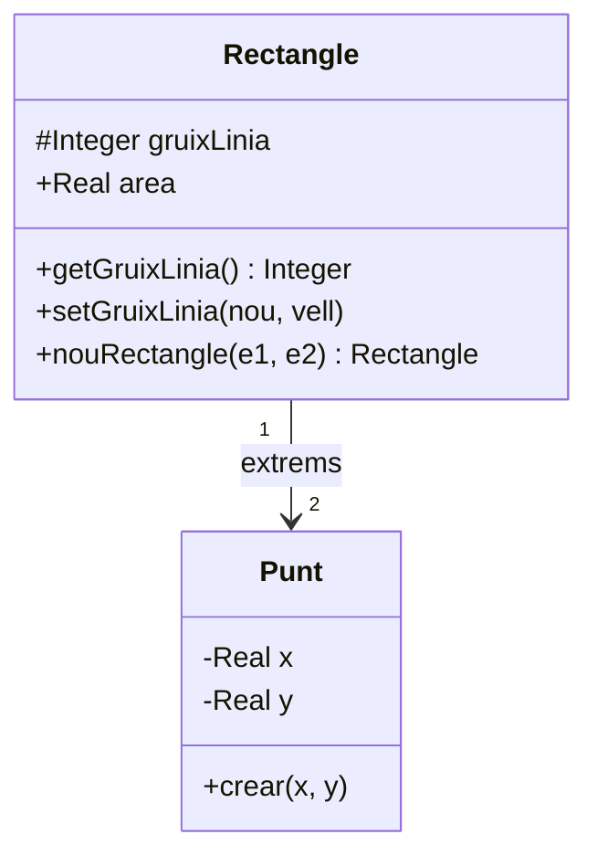
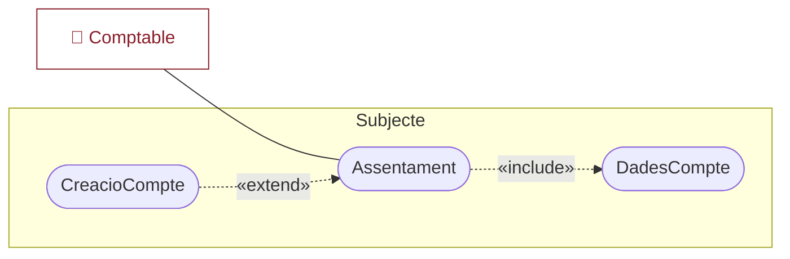
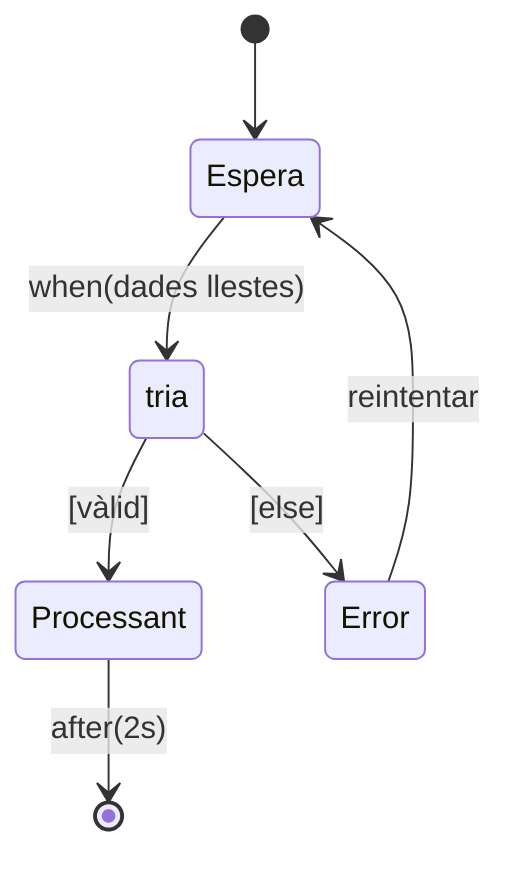
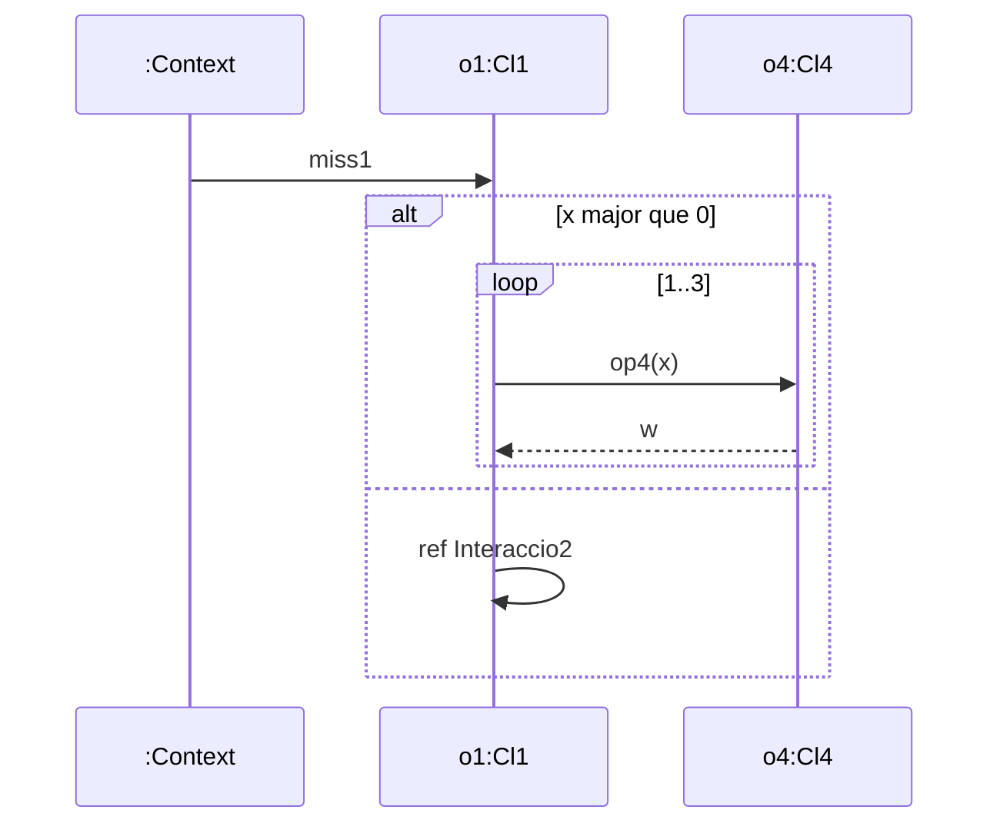

# UML — Referència completa

> Resum d'estudi del document de referència del curs **Anàlisi i Disseny d'Aplicacions** (Departament d'Enginyeria Informàtica i Matemàtiques, Universitat Rovira i Virgili). Fidel a l'original en català.

## Introducció

L'**OMG** (*Object Management Group*) és una organització internacional no lucrativa que té com a finalitat l'elaboració d'estàndards sobre eines relatives a la tecnologia d'objectes.

L'**UML** (*Unified Modeling Language*) és **un conjunt de conceptes i notacions utilitzables en el modelatge gràfic de programari orientat a l'objecte durant el seu desenvolupament**. Té l'origen en la unificació dels models utilitzats en 3 mètodes preexistents de desenvolupament orientat a l'objecte. UML **ni és per si sol un mètode de desenvolupament ni està lligat a cap mètode en particular**, i es pot fer servir dins de mètodes molt diversos.

### Els dos grups de diagrames d'UML

- **Diagrames d'estructura**: descriuen aspectes estructurals (*allò que el sistema té*): diagrama de paquets, de perfil, **de classes**, d'objectes, d'estructures compostes, de components, de desplegament.
- **Diagrames de comportament**: representen l'activitat del sistema (*allò que el sistema pot fer*): **de casos d'ús**, **d'estats**, **d'activitats**, **d'interacció** (variants: de seqüències, de comunicacions, de visió general de la interacció, temporal).

---

## Conceptes generals

### Element

- **Element**: concepte que té representació en els models mitjançant un **símbol geomètric bidimensional, una línia o una sèrie alfanumèrica (*String*)**.
- **Element tipificat**: element que pot tenir diferents valors d'un cert conjunt anomenat **tipus**.
- **Element derivat**: element redundant que s'obté mitjançant un algorisme a partir d'altres elements.
- **Notació**: en la sintaxi dels elements textuals, els mots clau estàndard d'UML van **en cursiva i entre cometes**, i els noms propis del model en lletra normal.

### Estereotip

- **Estereotip**: variant d'un element —l'**element base**— que té almenys la mateixa estructura i relacions, però pot tenir aspectes addicionals i un ús més restringit.
- **Notació**: el mateix símbol que l'element base més el nom de l'estereotip entre **«» (cometes llatines)**, o un símbol específic.

### Visibilitat

La **visibilitat** delimita quins altres elements del model tenen accés a un element:

| Símbol | Nom | Significat |
|---|---|---|
| **`+`** | *public* | accessible per als elements que poden accedir a l'espai de noms que el conté directament |
| **`-`** | *private* | només accessible pels elements de l'espai de noms que el conté directament |
| **`#`** | *protected* | visible per als elements del mateix espai de noms *A* i dels espais generalitzats per *A* (subclasses) |
| **`~`** | *package* | visible només pels elements continguts dins el paquet que conté el seu espai de noms |

### Comentari

- **Comentari**: explicació en llenguatge natural destinada només a ser llegida; **no té efecte sobre el funcionament** ni l'ha d'interpretar l'eina. Qualsevol element pot tenir comentaris.
- **Notació**: símbol de **nota** (full apaïsat amb un angle doblegat) connectat per **línies discontínues** als elements referits.

### Classificador

- **Classificador**: tipus que té **característiques (*features*) estructurals i de comportament**. És un **espai de noms** per a les seves característiques. Té estereotips estàndard (p. ex. la classe).
- **Notació**: **rectangle** dividit en compartiments; **l'únic obligatori és el superior** (nom + estereotip a sobre). El nom comença per majúscula i va centrat.

### Instància

- **Instància (*instance*)**: cada un dels valors d'un classificador. Pot pertànyer a diversos classificadors alhora.
- **Notació**: nom de la instància (opcional) seguit de **`:`** i la llista de classificadors separats per comes; **tots dos noms subratllats**. Ex.: `inst:Cl1, Cl2`.

### Col·lecció

- **Col·lecció**: conjunt de còpies d'instàncies del mateix classificador. Pot tenir elements duplicats i estar ordenada o no.

**Cardinalitat i multiplicitat:**

- **Cardinalitat**: **nombre d'instàncies** en un moment determinat.
- **Multiplicitat**: **quins valors pot tenir la cardinalitat**. Forma general: intervals `límit_inferior..límit_superior` separats per comes.
  - Límits = enters no negatius o expressions parametritzades. **`*`** = qualsevol valor no negatiu.
  - Ex.: `0..1, 3, 5..*` = qualsevol enter llevat de 2 i 4. `0..*` ≡ `*`. `0..0` és permesa.
  - Dins una especificació textual va entre **`[ ]`**.
  - Si el límit superior > 1 pot dur **`unique`** (cap duplicat; per defecte) / **`nonunique`**, i **`ordered`** / **`unordered`** (per defecte).

### Dependència

- **Dependència**: un o més elements (**clients**) depenen, per a la seva realització o especificació, d'altres elements (**subministradors / *suppliers***).
- **Notació**: **fletxa de punta oberta i línia discontínua** del client cap al subministrador, amb l'estereotip al costat.

### Format general dels diagrames

Cada diagrama es representa opcionalment dins d'un **marc amb capçalera** (etiqueta a l'angle superior esquerre), que pot tenir: *tipus de diagrama* (opcional), *nom del diagrama*, *valors dels paràmetres*.

---

## Diagrama de classes

És el diagrama d'estructura **bàsic i més general**. Els diagrames d'estructura descriuen **l'organització estàtica** del model.

### El concepte de classe

- **Classe**: descriu un conjunt d'entitats amb les mateixes propietats, comportament, relacions i semàntica. **És un estereotip del classificador**; les seves instàncies són els **objectes**.
- **Identitat**: els objectes tenen identitat; **dos objectes poden ser diferents encara que tinguin valors idèntics en tots els atributs**.

**Característiques estructurals** (anomenades **propietats**):

- **Atributs**: cada atribut pot tenir un valor o més d'un tipus. Els valors constitueixen l'**estat** de l'objecte.
- **Extrems d'associació.**
- **Atribut derivat**: atribut que és element derivat.

**Característiques de comportament**: les **operacions** (descriuen el comportament). Cada operació té una **signatura** (paràmetres i retorn). Un **mètode** és la descripció de la implementació d'una operació.

**Nivell de classe vs. objecte**: els **atributs/operacions de classe** es refereixen a tota la classe, no a un objecte concret; els **d'objecte** són el cas per defecte.

### Notació general de la classe

- Rectangle, opcionalment compartimentat verticalment.
- **Compartiment superior** (obligatori): nom (es recomana **en negreta**, majúscula, centrat) + estereotip (`class` per defecte).
- 2n compartiment = atributs; 3r = operacions.

**Llista d'atributs:**

```
^ visibilitat / nom_atribut : tipus [multiplicitat] = valor_per_defecte {cadena_de_propietats}
```

- **`^`** = atribut heretat · **`/`** = derivat · **visibilitat** (sense indicar = oculta) · **multiplicitat** (s'omet si és `1..1`).
- Propietats: `readOnly`, `redefines nom`, `ordered`/`unordered`, `unique`/`nonunique`, `seq`, **`id`** (part de l'identificador).
- **Atributs de classe**: nom i tipus **subratllats**.

**Llista d'operacions:**

```
^ visibilitat signatura {cadena de propietats}
```

- **signatura**: `nom_operació (llista_paràmetres) : tipus_retorn [multiplicitat]` (parèntesi obligatori).
- Cada paràmetre: `direccio nom : tipus [mult] = valor`. **direccio**: `in` (defecte), `out`, `inout`. El retorn pot expressar-se com a paràmetre `return`.
- Propietats: `query` (sense efectes col·laterals), `ordered`/`unordered`, `unique`/`nonunique`, `redefines`.
- **Operacions de classe**: signatura **subratllada**. **Operacions abstractes**: signatura **en cursiva** o `abstract`.

**Exemple — `Rectangle`:** `+extrems: Punt [2]` (matriu de 2 Punt), `#gruixLinia: Integer = 1` (protegit, valor inicial 1), `+/area: Real` (derivat), `+getGruixLinia(): Integer {query}`, `+setGruixLinia(nouGruix: Integer, out vellGruix: Integer)`, operació de classe `«constructor» +nouRectangle(...): Rectangle` (subratllada).



> 💡 **Com llegir-ho:** `-` privat, `#` protegit, `+` públic · els **atributs/operacions de classe** van subratllats · `area` és **derivat** (`/`) · les fletxes amb multiplicitat (`2`) són els extrems d'associació.

### Notació de l'objecte

Com la de la classe; té el compartiment del nom i pot tenir el dels atributs (només d'objecte). Si pertany a estats: després del nom de classe, entre `[ ]`, la llista d'estats. El nom de l'objecte i el de la classe van subratllats. Valors successius en el temps es relacionen amb dependències `becomes`.

### Interfície

- **Interfície**: classificador que consisteix en una **declaració de característiques públiques** que componen el **contracte**. Com que és una declaració, **no se'n poden crear instàncies** directament; ha d'estar implementada per almenys un classificador instanciable (amb una **dependència de realització**).
- Totes les operacions de la interfície les ha de tenir el classificador que la implementi (mateixa signatura). Un classificador pot implementar diverses interfícies i viceversa.
- **Notacions**: aïllada amb `«interface»`; **interfície suportada** (implementada) = **cercle ple (●)** unit per línia contínua; **interfície requerida** = **mig cercle (⊃)**. (Notació de "bola i sòcol".)

### Tipus de dades i literals

- **Tipus de dades**: classificadors les instàncies dels quals s'anomenen **valors** i **no tenen identitat**; les seves operacions **no tenen efectes col·laterals**. Inclouen enumeracions i tipus primitius.
- **Enumeració**: tipus de dades amb instàncies que són **literals** especificats un a un; **l'ordre és significatiu**. Notació `«enumeration»`.
- **Tipus primitius** d'UML: **`Boolean`** (`true`/`false`), **`Integer`**, **`Real`**, **`UnlimitedNatural`** (naturals des d'1 més `*` = il·limitat), **`String`**.
- **Literals**: *String* entre cometes; *Boolean* `true`/`false` (defecte `false`); *Integer* (defecte 0); *Real* decimal o científica (`E`/`e`); nuls `null`.

---

## Associacions

- **Associació**: classificador que descriu una **relació entre diversos classificadors**, amb reflex a nivell d'instàncies.
- **Extrems d'associació (*association end*)**: a cadascun, un classificador fa un **paper (*role*)**.
- **Enllaços (*links*)**: **tuples formades per instàncies dels classificadors dels extrems** (un enllaç és a una associació com un objecte a una classe).
- **Navegabilitat**: es pot accedir eficientment de l'extrem *a* a l'extrem *b*.
- **Associació derivada**: redundant, conseqüència d'altres associacions o restriccions.
- **Classe associativa**: associació que és alhora classe (quan els enllaços tenen atributs/operacions propis).
- **Qualificador**: atribut(s) d'un extrem que delimiten el nombre d'objectes enllaçats amb els mateixos valors.

### Notacions de l'associació

- **Binària**: **línia contínua** entre els dos classificadors.
- **3 extrems o més**: **rombe buit** (més gros que el d'agregació) unit per línies.

Elements que poden acompanyar-la: **nom** (minúscula; en classe associativa, majúscula i = nom de la classe); **`/`** = derivada; línia discontínua + **`{xor}`** entre dues associacions amb extrem comú = **alternatives**; **classe associativa** unida per línia discontínua.

Elements d'un **extrem**: **nom del paper**; **multiplicitat**; **indicador de navegabilitat** (**fletxa de punta oberta**; **`x`** per indicar que NO hi ha navegabilitat); **qualificador** (rectangle petit interposat); **visibilitat**; propietats (`redefines`, `ordered`, `nonunique`, `seq`).

### Exemples

- **Binària amb papers i multiplicitats**: `Empresa 0..1 (empleador) —— 1..* (empleat) {ordered} Persona`. Cada persona pot tenir un lloc de treball; tota empresa té almenys un empleat; els empleats estan ordenats.
- **Classe associativa** `Lloc de treball` (atribut `salari: float`) sobre Empresa–Persona: unida per línia discontínua. Si la cardinalitat màxima d'*empleador* fos 1 n'hi hauria prou d'afegir `salari` a `Persona`.
- **Qualificador**: `Departament —[categoria]— Empleat` (`1..*` / `2..5`): a cada departament hi ha entre 2 i 5 empleats **de cada categoria**.
- **Alternatives `{xor}`**: `Compte` enllaçat a `Proveidor` o a `Client` (cada compte correspon a un o a l'altre).

### Agregació i composició

- **Agregació**: associació binària on **un objecte (component) és part d'un altre (agregat)**. L'agregat "coneix" els components, no viceversa.
- **Composició**: agregació que compleix **alhora**: (a) els components només es creen si existeix l'agregat; (b) cada component forma part d'un sol agregat; (c) no pot passar d'un agregat a un altre; (d) en esborrar/copiar l'agregat, els components també. **Composició = per contingut**; agregació no composició = **per referència**.
- **Notació**: **rombe** al costat de la classe agregada: **ple (♦)** → composició; **buit (◇)** → agregació.
- **Exemple composició**: `Universitat ♦—1——1..*— CentreUniversitari` (cada centre fa part d'una sola universitat; si se suprimeix la universitat, també els centres).

---

## Generalització, especialització i herència

### En les classes

- Si la classe *A* és subconjunt de *B*: **A és subclasse de B i B superclasse d'A**.
- **Herència**: la subclasse té almenys **tots els atributs, operacions, associacions i dependències** de la superclasse.
- **Herència múltiple**: subclasse de diverses superclasses alhora.
- **Conjunt de generalització** (amb nom si n'hi ha més d'un) i propietats `{...}`:
  - **`complete`** (tota instància pertany a algun subconjunt) / **`incomplete`** (defecte);
  - **`overlapping`** (pot pertànyer a diversos) / **`disjoint`** (defecte).
- **Classe abstracta**: no instanciable; pot tenir **operacions abstractes** (sense mètode) que les subclasses han d'implementar.
- **Notació**: **fletxa de línia contínua i punta triangular buida (△)** cap a la superclasse.

**Exemples**: `Alumne` *(abstracte)* amb conjunt `Ensenyament {complete, disjoint}` → `AlumneGET`, `AlumneGEI`, `AlumneMIA`. `AlumneDoctorat` que hereta d'`Alumne` i `Professor` (herència múltiple).

### En altres classificadors i associacions

- Entre **interfícies** pot haver-hi herència (fins i tot múltiple). Si *C* implementa *I*, implementa també les interfícies de què *I* hereta.
- **Especialització d'associacions**: entre dues associacions (p. ex. `client habitual` subassociació de `client qualsevol`). Una classe associativa pot heretar d'una classe ordinària.

---

## Diagrama de casos d'ús

Identifica els comportaments executants d'un classificador de context i especifica amb quins usuaris i entitats exteriors interaccionen.

### Subjecte

- **Subjecte**: classificador de context dels comportaments (sistema, subsistema, component o classe). No se sol representar; si es fa, rectangle que conté les el·lipses.

### Actor

- **Actor**: **conjunt de papers que fa una entitat externa al subjecte**. És un classificador instanciable. Pot ser: una persona/usuari, un sistema informàtic extern, un dispositiu físic, o **`Temps`/`Rellotge`**. La infraestructura de maquinari/xarxa NO és actor.
- **Notació**: `«actor»` o **ninot (stickman)** amb el nom a sota (cursiva si és abstracte).

**Relacions entre actors**: **generalització/herència** (l'actor especialitzat hereta els papers del generalitzat). **Actors abstractes**: tota instància que intervé ha de pertànyer a algun dels que l'especialitzen.

### Cas d'ús

- **Cas d'ús**: **comportament executant del subjecte**; és engegat per un actor i lliura resultats a un o més actors. El diagrama no en descriu el contingut.
- **Notació**: **el·lipse** amb el nom.

**Relacions amb els actors**: només **associacions binàries**. **Actor primari** (engega el cas) i **actors secundaris** (només reben/subministren informació quan el subjecte ho demana).

**Relacions entre casos d'ús:**

- **`«extend»`** (extensió): del cas *A* al *B* amb una **condició** i un **punt d'extensió** de *B*. Si en executar *B* es compleix la condició al punt, s'insereixen els fragments d'*A*. (Comportament **condicional**.)
- **`«include»`** (inclusió): *A* **sempre** inclou el comportament de *B* (com una crida d'operació, **sense condició**). El cas inclòs normalment no és executable independentment.
- **Generalització/especialització/herència**: cas més especialitzat; pot haver-hi **casos d'ús abstractes** (cada execució és la d'algun que l'especialitza). S'usa quan el comportament compartit no és una seqüència de passos consecutius.
- **Notació**: `«extend»`/`«include»` amb **fletxa discontínua de punta oberta**; punts d'extensió en un compartiment del cas; generalització amb fletxa de punta triangular buida; cas abstracte amb nom en cursiva.



> 📌 **Regla d'or:** `«include»` = comportament **sempre** obligatori i compartit (com una crida). `«extend»` = comportament **condicional** (només en un punt d'extensió). La generalització entre casos s'usa quan el comú **no** és una seqüència de passos consecutius.

---

## Diagrama d'estats

Descriu els comportaments de les instàncies d'un classificador en termes del seu **pas per diferents situacions (estats)**. Els canvis són conseqüència d'**esdeveniments** i causa de l'execució de comportaments, i poden estar subjectes a condicions.

### Conceptes previs

**Senyal**: instància que *o1* envia a *o2*; provoca un comportament en *o2*. **No pot tornar resposta**. Notació `«signal»`. La **recepció de senyal** és un estereotip d'operació (`«signal»`, sense paràmetres out/inout ni retorn).

**Esdeveniment (*event*)**: succés que pot alterar l'execució d'un comportament. **Ocurrència** = es produeix en un instant. Es col·loquen en una **cua**. **Disparador (*trigger*)**: especifica que una ocurrència pot engegar un comportament.

**Classificació**:

- **De missatge**: **de senyal** (arribada d'un senyal), **de crida (*call event*)** (invocació d'una operació), **`anyReceive`**.
- **De temps**: `after("expressió")` (durada des de l'entrada a l'estat) / `at("data_i_hora")`.
- **De canvi**: `when(expressió booleana)` (l'expressió passa a ser certa).

### Màquina d'estats

- **Màquina d'estats**: **graf orientat** amb **vèrtexs** (nodes) i **transicions** (arcs). Vèrtexs: **estats**, referències a punts de connexió, **pseudoestats**.
- Pot ser **redefinida** per especialització → màquina estesa.

### Estat

- **Estat**: vèrtex que representa una situació amb un **invariant**.
- **Esdeveniments diferits**: una ocurrència que no engega transició es perd, **tret que el tipus estigui definit com a diferit** (`nom / defer`).

**Tipus**: **simple** (sense regions), **compost** (conté una o més **regions** amb subestats; cada subestat en una sola regió), **de submàquina** (insereix una màquina descrita a part; permet reutilització).

**Comportaments associats**: **d'entrada** (`entry`, en esdevenir actiu), **de sortida** (`exit`), **durant l'estat / do-activities** (`do`). En acabar es genera una **ocurrència de finalització (*completion event*)** que pot engegar una **transició de finalització**.

**Notació de l'estat simple**: rectangle de cantonades arrodonides amb el nom; representació completa amb compartiments (nom / comportaments interns / transicions internes).

### Vèrtexs altres que l'estat

- **Pseudoestat inicial**: un per màquina; en surt una transició cap a l'**estat per defecte** (sense disparador ni guarda). **Notació: circumferència plena (●)**.
- **Estat final**: no en surt cap transició. **Notació: "ull de bou" (◉)**.
- **Pseudoestat terminal**: en arribar-hi s'acaba l'execució de la màquina (l'objecte és destruït). **Notació: dues barres en X (✕)**.
- **Pseudoestat d'embrancament (*junction*)**: combina transicions; les de sortida duen guardes (una pot ser **`else`**). **Notació: circumferència plena (●)**.
- **Pseudoestat de tria (*choice*)**: com l'embrancament, però amb guardes calculades en temps d'execució. **Notació: rombe (◇)**, p. ex. `[x<=10]` / `[x>10]`.

### Transicions simples

- **Transició simple**: pas d'un vèrtex d'origen a un de destinació; cal una ocurrència de l'esdeveniment del disparador i, opcionalment, una **guarda**.
- **Transició interna**: **no comporta canvi d'estat** (≠ **autotransició**, que sí executa els comportaments de sortida i d'entrada).
- **Notació**: **fletxa de línia contínua i punta oberta** amb etiqueta `disparador [guarda] / comportament`.



> 💡 **Llegenda:** ● inicial → estat per defecte · ◇ **pseudoestat de tria** (guardes `[...]`) · ◉ estat final. Disparadors: `when(...)` (canvi), `after(...)` (temps), o un esdeveniment de senyal/crida.

### Estats compostos i de submàquina

- **Notació de l'estat compost**: compartiment amb la regió o regions separades per **línies discontínues**.
- **Pseudoestat d'unió (*join*)**: exigeix que s'hagin produït totes les transicions que hi entren (regions diferents). **Notació: barra travessera gruixuda (━━)**.
- **Pseudoestat de bifurcació (*fork*)**: un origen → diverses destinacions en regions diferents. **Notació: barra travessera gruixuda (━━)**.
- **Punt d'entrada** (○) / **punt de sortida** (⊗): interfície de connexió d'una submàquina/estat compost.
- **Maneres d'entrar/sortir** d'un estat compost: per defecte, explícitament (a un subestat) o per un punt d'entrada/sortida.
- **Notació de l'estat de submàquina**: `nom_estat : nom_submàquina`, amb els punts d'entrada/sortida sobre el contorn.

---

## Diagrama d'activitats

Descriu un comportament com un **graf orientat** amb relacions de **prerequisit (eventualment condicionals)** entre activitats. Nodes = **nodes d'activitat**; arcs = **arcs d'activitat**. Pels arcs circulen **signes (*tokens*)**.

### Arcs i signes

- **Arc de flux de control**: relacions de prerequisit (hi circulen **signes de control**).
- **Arc de flux d'objectes**: dades creades/modificades es fan servir en altres activitats (hi circulen **signes d'objecte** = còpies d'instàncies).
- **Signe nul**: sense contingut.

### Nodes

- **Nodes de control**: node inicial, node final (d'activitat / de flux), de fusió, de decisió, de bifurcació (*fork*), d'unió (*join*).
- **Nodes executables**: **acció** (activitat indescomponible); nodes d'activitat estructurada (seqüència, condicional, bucle, expansió).
- **Nodes d'objectes**: paràmetre d'activitat; **pin** (entrada/valor/sortida); node central de *buffer*; node d'expansió.

**Acció**: **rectangle amb angles arrodonits**. Serveix també per a activitats en general.

**Node d'objectes**: **rectangle** amb el nom del tipus precedit de `:` (`nom1:Tipus1 [estat1, estat2]`).

- **Paràmetre d'activitat**: node d'objectes pel qual entra/surt un arc; sobre el perímetre de l'activitat. **Stream** (rep/envia signes durant tota l'execució) / **d'excepció** (signe en cas d'excepció).
- **Pin**: node d'objectes que conté un signe que entra (**pin d'entrada**) o que genera (**pin de sortida**) una acció. Petit rectangle annex; fletxa interior indica entrada/sortida. Té **multiplicitat**.
- **Node d'emmagatzematge de dades**: estereotip **`«datastore»`** (conserva el signe i n'envia còpies; el nou substitueix l'anterior). **`«centralBuffer»`** = memòria intermèdia.

### Arcs d'activitat

- **Arc d'activitat**: connexió **unidireccional**. Opcionalment: nom, **guarda** (condició), **pes** (`{weight= expr}`).
- **Notació**: **fletxa de línia contínua i punta oberta**.
- **Arc d'objectes**: propietats `create`/`read`/`update`/`delete` indiquen l'efecte; selecció en nota `«selection»`.
- **Arc de control**: un cop acabada l'activitat d'origen, es pot executar la de destinació.

### Nodes de control

- **Node inicial**: només sortides; en engegar-se posa un signe a tots. **Notació: rodona plena (●)**.
- **Node final de flux**: destrueix els signes que hi arriben. **Notació: circumferència amb una X (⊗)**.
- **Node final d'activitat**: en arribar un signe, destrueix els altres i **acaba l'activitat**. **Notació: "ull de bou" (◉)**.
- **Node de decisió**: un entrada, diverses sortides amb **guarda** (una pot ser `else`); se'n compleix exactament una. **Notació: rombe (◇)**; decisió en nota `«decisionInput»`.
- **Node de fusió (*merge*)**: diverses entrades, una sortida. Fusió + decisió → un sol rombe.
- **Node de bifurcació (*fork*)**: una entrada, diverses sortides **concurrents** (còpia a cadascuna). **Notació: línia curta gruixuda (━━)**.
- **Node d'unió (*join*)**: diverses entrades, una sortida (espera totes). **Notació: línia curta gruixuda (━━)**; `{joinSpec= ...}` (defecte `and`).

### Nodes executables estructurats

- **Node d'activitat estructurada**: grup d'activitats que **s'executa com una unitat**. Tipus: **de seqüència**, **condicional** (clàusules: secció de prova + cos; només s'executa un cos), **de bucle** (seccions *setup* / *test* / *body*). **Notació: rectangle de línia discontínua amb estereotip `«structured»`**.
- **Regió d'expansió**: activitat estructurada amb **nodes d'expansió** (col·leccions de signes). **Tipus d'expansió**: **`«parallel»`**, **`«iterative»`** (en ordre), **`«stream»`** (tots en una execució).

### Execució

- Una **acció** s'executa quan: ha arribat un signe de control per cada arc de control; cada pin d'entrada té ≥ cardinalitat mínima; es compleixen les precondicions. En acabar: posa signes als pins de sortida i un signe als arcs de control de sortida. En **excepció**: s'abandona; si hi ha pin de sortida d'excepció, passa l'objecte a un gestor.

### Partició d'activitats

- **Partició**: grup d'activitats amb una cosa en comú (responsabilitat d'un classificador, d'una instància, o un valor d'atribut). **Dimensió**: partició no continguda en cap altra.
- **Notació**: **franja/carril (*swimlane*)** delimitada per rectes paral·leles, amb el nom centrat. Un node pot estar en una franja vertical i una d'horitzontal, però no sobre una línia de separació. `«attribute» atr: Val` (partició per atribut); `«external»` (nodes externs).

---

## Diagrames d'interacció (seqüències)

Descriuen un comportament en termes dels **senyals i crides d'operacions** entre instàncies. Variants: de seqüències, de comunicacions, de visió general, temporal. **Ens centrem en el de seqüències.**

- **Interacció**: comportament emergent descrit en termes de **missatges**.
- **Ús d'interacció**: referència a una interacció dins una altra.

### El diagrama de seqüències

Posa èmfasi en els missatges i en la **seqüència temporal**; una dimensió (normalment la **vertical, cap avall**) representa el **temps**.

### Línia de vida

- **Línia de vida (*lifeline*)**: representa una instància (o un classificador). En representa **tota l'existència** (creació → destrucció).
- **Notació**: **línia vertical discontínua** sota el rectangle del classificador/instància. Dins: `nom : classificador` o **`self`**. **L'ordre esquerra-dreta no té significat.** Text mai subratllat.
- Instància **creada** dins la interacció: la fletxa del missatge de creació acaba al començament de la ldv. Instància **destruïda**: **X (✕)** sobre la ldv.

### Fragment d'interacció

- **Fragment combinat**: **operador d'interacció** + **operands**. Cada operand pot tenir una **restricció**.

**Operadors:**

- **`alt`**: elecció entre operands (com a màxim un); restriccions (una pot ser `else`).
- **`break`**: guarda + operand; si es compleix, s'executa en comptes de la resta del fragment.
- **`loop`**: un operand amb restricció (mín/màx de vegades o condició).
- **`opt`**: un operand que s'executa o no.
- **`par`**: operands en **paral·lel**.
- **`ref`**: representa un **ús d'interacció**.

**Notació**: marc amb mot clau a la capçalera (**`sd`** = interacció sencera; mot clau de l'operador = fragment combinat amb operands en franges separades per línies discontínues).

### Missatge

- **Missatge**: comunicació de l'**emissor** al **destinatari** (senyal, crida d'operació, o resposta amb retorn i paràmetres out/inout).
- **Síncron**: l'emissor **roman aturat** fins rebre el **missatge de resposta**. **Asíncron**: l'emissor **continua executant-se** (un síncron només pot ser crida d'operació).

**Notació:**

| Tipus de missatge | Fletxa |
|---|---|
| **Asíncron** | línia contínua, **punta oberta** (→) |
| **Síncron** | línia contínua, **punta plena** (▶) |
| **De resposta** (d'un síncron) | línia **discontínua**, punta oberta (⇢) |
| **Que provoca creació d'objecte** | línia discontínua; acaba al començament de la ldv del receptor |

- **Portal (*gate*)**: punt del contorn del fragment d'on surt/entra un missatge cap a/de fora.
- **Nom**: `nom_operació_o_senyal (arg1, ...)` (cada argument amb `nom_paràmetre=` opcional; `-` = indefinit). De resposta: `atribut = nom_operació(args) : valor_de_retorn`.
- Fletxa **horitzontal** = transmissió instantània; **descendent** = durada no negligible. Poden tenir restriccions temporals.



> 💡 **Tipus de fletxa:** `▶` plena = missatge **síncron** (l'emissor s'atura fins la resposta) · `→` oberta = **asíncron** · `⇢` discontínua = **resposta**. Els fragments `alt` (alternativa), `loop` (bucle), `par` (paral·lel) i `ref` (ús d'interacció) agrupen missatges.

---

## Conceptes clau (glossari)

- **OMG** — organització que elabora estàndards d'eines de tecnologia d'objectes.
- **UML** — llenguatge gràfic de modelatge OO; no és un mètode ni hi està lligat.
- **Element / Estereotip** — concepte amb representació al model / variant d'un element base, entre «».
- **Visibilitat** — `+` public, `-` private, `#` protected, `~` package.
- **Classificador** — tipus amb característiques; rectangle compartimentat; espai de noms.
- **Instància** — cada valor d'un classificador; nom subratllat seguit de `:classificadors`.
- **Multiplicitat** — quins valors pot tenir la cardinalitat (`inf..sup`, `*`); `unique`/`ordered`.
- **Dependència** — un client depèn d'un subministrador; fletxa discontínua de punta oberta.
- **Classe / Objecte** — estereotip de classificador amb objectes (instàncies amb identitat).
- **Atribut derivat (`/`) / de classe (subratllat)**.
- **Operació abstracta** — cursiva o `{abstract}`; sense mètode.
- **Interfície** — declaració de característiques públiques (contracte); no instanciable; `«interface»`.
- **Tipus de dades / Enumeració** — valors sense identitat; `«dataType»` / `«enumeration»`.
- **Associació / Enllaç** — relació entre classificadors / tuple d'instàncies.
- **Navegabilitat** — accés eficient d'un extrem a l'altre; fletxa de punta oberta.
- **Classe associativa** — associació que és alhora classe; unió per línia discontínua.
- **Qualificador** — atribut d'un extrem que delimita els objectes enllaçats; rectangle petit interposat.
- **Agregació (◇) / Composició (♦)** — "part-tot" feble / per contingut (el component no existeix sense l'agregat).
- **Generalització/herència (△)** — la subclasse hereta atributs, operacions, associacions.
- **Classe abstracta** — nom en cursiva; no instanciable.
- **Conjunt de generalització** — `{complete/incomplete, disjoint/overlapping}`.
- **Cas d'ús (el·lipse) / Actor (ninot)**.
- **`«include»` / `«extend»`** — inclusió (obligatòria) / extensió (condicional, amb punt d'extensió).
- **Estat / Transició** — situació amb invariant / `disparador [guarda] / comportament`.
- **Esdeveniment / disparador** — de missatge/senyal/crida, de temps (`after`/`at`), de canvi (`when`).
- **Pseudoestat inicial (●) / estat final (◉) / terminal (✕)**.
- **Estat compost / Fork-Join (━━)** — regions amb subestats / bifurcació-unió de regions concurrents.
- **Diagrama d'activitats** — graf de nodes i arcs amb signes (*tokens*).
- **Acció (rectangle arrodonit) / Pin / Partició (carril)**.
- **Node de decisió (◇) / fusió / fork (━━) / join**.
- **Regió d'expansió** — `«parallel»`/`«iterative»`/`«stream»`.
- **Línia de vida** — existència d'una instància; línia vertical discontínua.
- **Missatge síncron (▶) / asíncron (→) / de resposta (⇢)**.
- **Fragment combinat** — `alt`, `opt`, `loop`, `par`, `break`, `ref`.

---

## Preguntes de repàs

1. **Els dos grans grups de diagrames i en què es diferencien?** Diagrames d'**estructura** (allò que el sistema *té*, estàtic) i de **comportament** (allò que el sistema *pot fer*).
2. **Què signifiquen `+`, `-`, `#`, `~`?** Public / private / protected (mateix espai + subclasses) / package.
3. **Cardinalitat vs. multiplicitat?** La cardinalitat és el nombre d'instàncies en un moment; la multiplicitat estableix quins valors pot tenir.
4. **Com es distingeix un atribut/operació de classe?** Porta el nom (i tipus/signatura) **subratllat**.
5. **Què indica `/` davant del nom?** Que és **derivat/derivada**.
6. **Condicions perquè una agregació sigui composició?** Components només si existeix l'agregat; cada component en un sol agregat; no es transfereix; en esborrar/copiar l'agregat, també els components. Rombe **ple (♦)**.
7. **Com es representa la generalització i què hereta la subclasse?** Fletxa de punta triangular buida (△) cap a la superclasse; hereta atributs, operacions, associacions i dependències.
8. **Què signifiquen `{complete, disjoint}`?** complete = tota instància pertany a algun subconjunt; disjoint = a cap n'hi pertany a dos alhora.
9. **`«include»` vs. `«extend»`?** include = sempre (sense condició); extend = només si es compleix una condició al punt d'extensió.
10. **Actor primari vs. secundari?** El primari engega el cas; el secundari només rep/subministra informació quan el subjecte ho demana.
11. **Sintaxi d'una transició simple?** `disparador [guarda] / comportament`.
12. **Transició interna vs. autotransició?** La interna no canvia d'estat ni executa sortida/entrada; l'autotransició **sí** les executa.
13. **Tres comportaments interns d'un estat?** `entry`, `exit`, `do`.
14. **Fork i join en activitats, i com es noten?** Fork = una entrada → diverses sortides concurrents; join = espera totes. Tots dos: **barra gruixuda (━━)**.
15. **Missatge síncron vs. asíncron i notació?** Síncron (punta plena ▶): l'emissor s'atura fins la resposta; asíncron (punta oberta →): continua. Resposta = línia discontínua (⇢).
16. **`alt` vs. `opt` vs. `par`?** alt = elecció (un operand); opt = un operand que s'executa o no; par = tots en paral·lel.
